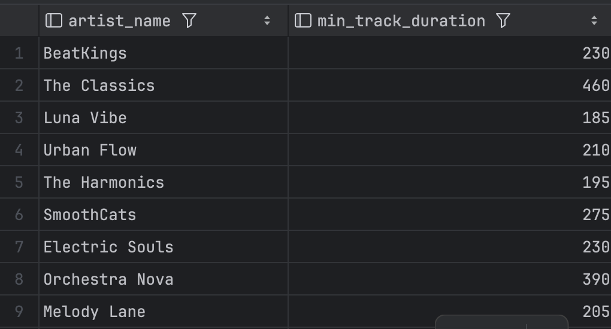

1. Получить страны и количество пользователей
```sql
SELECT country, COUNT(*) AS users_count
FROM "user"
GROUP BY country;
```

2. Получить артистов и количество треков
```sql
SELECT 
    a.name AS artist_name, 
    COUNT(t.id) AS track_count
FROM artist a
LEFT JOIN track t ON a.id = t.artist_id
GROUP BY a.name;
```

3. Средняя цена подписок
```sql
SELECT AVG(price) AS avg_price
FROM subscription;
```

4. Средняя длина треков по жанрам
```sql
SELECT genre_id, AVG(duration_seconds) AS avg_duration
FROM track
GROUP BY genre_id;
```

5. Общая продолжительность треков в каждом альбоме
```sql
SELECT
    a.title AS album_name,
    SUM(t.duration_seconds) AS total_duration
FROM album a JOIN track t ON a.id = t.album_id
GROUP BY a.title;
```

6. Сколько пользователи потратили на определенный вид подписки
```sql
SELECT s.name as subscription_name, SUM(s.price) as total_price
FROM subscription s
JOIN "user" u ON u.subscription_id = s.id
GROUP BY s.name;
```

7. Артист и продолжительность самого короткого трека
```sql
SELECT a.name as artist_name, 
       MIN(t.duration_seconds) as min_track_duration 
FROM artist a JOIN track t ON a.id = t.artist_id 
GROUP BY a.name;
```

8. Самая дешевая подписка
```sql
SELECT 
    MIN(price) AS cheapest_subscription
FROM subscription;
```

9. Саммый длинный трек в каждом альбоме
```sql
SELECT
    al.title AS album_name,
    MAX(t.duration_seconds) AS longest_track
FROM album al
JOIN track t ON al.id = t.album_id
GROUP BY al.title;
```

10. Максимальная стоимость подписки
```sql
SELECT 
    MAX(price) AS max_price
FROM subscription;
```

11. Список треков в альбоме
```sql
SELECT
    al.title AS album_name,
    STRING_AGG(t.title, ', ') AS tracks
FROM album al
JOIN track t ON al.id = t.album_id
GROUP BY al.title;
```

12. Список треков по жанрам
```sql
SELECT 
    g.name AS genre_name,
    STRING_AGG(t.title, ', ') AS tracks
FROM genre g
JOIN track t ON g.id = t.genre_id
GROUP BY g.name;
```

13. Количество треков у артистов, у которых не меньше 2 треков
```sql
SELECT a.name, COUNT(*) 
FROM artist a JOIN track t ON a.id = t.artist_id 
GROUP BY a.name HAVING count(t.id) >= 2
```

14. Средняя длительность треков по жанрам, где средняя длительность больше 200 секунд
```sql
SELECT 
    g.name AS genre_name,
    AVG(t.duration_seconds) AS avg_duration
FROM genre g
JOIN track t ON g.id = t.genre_id
GROUP BY g.name
HAVING AVG(t.duration_seconds) > 200;
```

15. Общее количество треков по артистам и по альбомам
```sql
SELECT 
    a.name AS artist_name,
    al.name AS album_name,
    COUNT(t.id) AS track_count
FROM track t
JOIN artist a ON t.artist_id = a.id
JOIN album al ON t.album_id = al.id
GROUP BY GROUPING SETS ((a.name), (al.name)); 
```

16. Количество треков по жанрам и исполнителям
```sql
SELECT 
    g.name AS genre_name,
    a.name AS artist_name,
    COUNT(t.id) AS track_count
FROM track t
JOIN genre g ON t.genre_id = g.id
JOIN artist a ON t.artist_id = a.id
GROUP BY GROUPING SETS ((g.name), (a.name));
```

17. Количество треков по артистам и альбомам (с промежуточными итогами)
```sql
SELECT 
    a.name AS artist_name,
    al.name AS album_name,
    COUNT(t.id) AS track_count
FROM track t
JOIN artist a ON t.artist_id = a.id
JOIN album al ON t.album_id = al.id
GROUP BY ROLLUP (a.name, al.name);
```

18. Общая сумма длительности треков по жанрам и артистам
```sql
SELECT 
    g.name AS genre_name,
    a.name AS artist_name,
    SUM(t.duration_seconds) AS total_duration
FROM track t
JOIN genre g ON t.genre_id = g.id
JOIN artist a ON t.artist_id = a.id
GROUP BY ROLLUP (g.name, a.name);
```


19. Список треков жанра "Rock" длительностью больше 3 минут
```sql
SELECT t.title, t.duration_seconds, g.name AS genre
FROM track t
JOIN genre g ON t.genre_id = g.id
WHERE g.name = 'Rock' AND t.duration_seconds > 180
ORDER BY t.duration_seconds DESC;
```

20. Пользователи с активной подпиской, отсортированные по дате регистрации
```sql
SELECT u.username, s.name AS subscription, u.date_joined
FROM "user" u
JOIN subscription s ON u.subscription_id = s.id
WHERE s.price > 0
ORDER BY u.date_joined ASC;
```
