## 1. Процедура добавления комментария

Процедура `make_comment` добавляет новый комментарий к треку от пользователя, если точно такой же комментарий от этого же пользователя к этому же треку еще не существует.

```sql
CREATE OR REPLACE PROCEDURE make_comment(
    IN p_user_id INTEGER,
    IN p_track_id INTEGER,
    IN p_content TEXT
)
LANGUAGE plpgsql
AS $$
BEGIN
    IF NOT EXISTS (
        SELECT 1 FROM comment
        WHERE comment.user_id = p_user_id AND comment.track_id = p_track_id AND comment.content = p_content
    ) THEN
        INSERT INTO comment (user_id, track_id, content, created_at)
        VALUES (p_user_id, p_track_id, p_content, NOW());
    END IF;
END;
$$
```
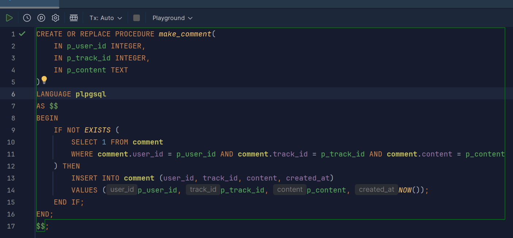
## 2. Процедура подписки на артиста

Процедура `follow_artist` позволяет пользователю подписаться на артиста. Если пользователь уже подписан, ничего не происходит.

```sql
CREATE OR REPLACE PROCEDURE follow_artist(
    IN p_user_id INTEGER,
    IN p_artist_id INTEGER
)
LANGUAGE plpgsql
AS $$
BEGIN
    IF NOT EXISTS (
        SELECT 1 FROM follow
        WHERE follow.user_id = p_user_id AND follow.artist_id = p_artist_id
    ) THEN
        INSERT INTO follow (user_id, artist_id, created_at)
        VALUES (p_user_id, p_artist_id, NOW());
    END IF;
END;
$$
```

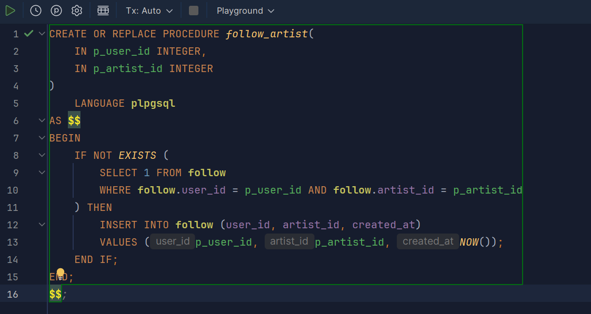

## 3. Процедура отписки от артиста

Процедура `unfollow_artist` удаляет подписку пользователя на артиста, если она существует.

```sql
CREATE OR REPLACE PROCEDURE unfollow_artist(
    IN p_user_id INTEGER,
    IN p_artist_id INTEGER
)
LANGUAGE plpgsql
AS $$
BEGIN
    DELETE FROM follow
    WHERE user_id = p_user_id AND artist_id = p_artist_id;
    RAISE NOTICE 'Пользователь % отписан от артиста %', p_user_id, p_artist_id;
END;
$$
```

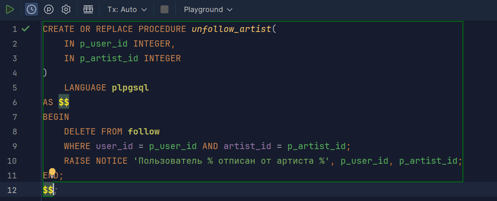

## 3.0 Получение всех процедур

```sql
SELECT routine_name, routine_type
FROM information_schema.routines
WHERE routine_type = 'PROCEDURE'
  AND routine_schema NOT IN ('pg_catalog', 'information_schema');
```

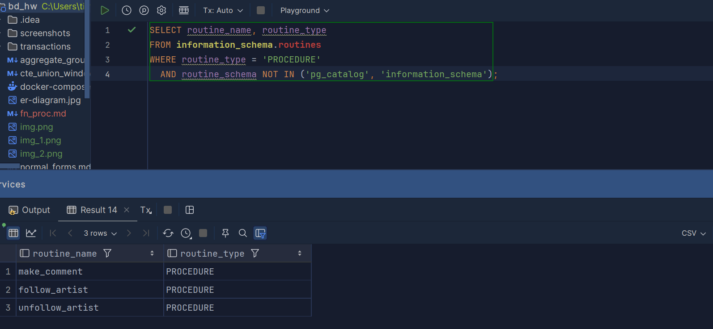

## 4. Функция для получения количества лайков

Функция `get_track_likes` возвращает общее количество лайков для указанного трека.

```sql
CREATE OR REPLACE FUNCTION get_track_likes(
    IN p_track_id INTEGER
)
RETURNS INTEGER
LANGUAGE plpgsql
AS $$
DECLARE
    like_count INTEGER;
BEGIN
    SELECT COUNT(*)
    INTO like_count
    FROM "like"
    WHERE "like".track_id = p_track_id;

    RETURN like_count;
END;
$$
```

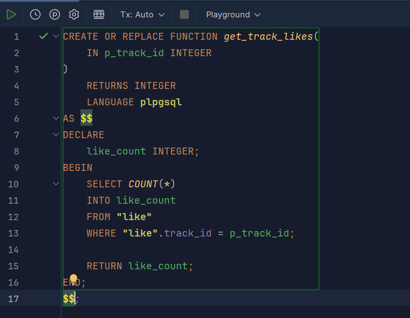


## 5. Функция для получения количества плейлистов пользователя

Функция `get_user_playlist_count` возвращает количество плейлистов, созданных пользователем.

```sql
CREATE OR REPLACE FUNCTION get_user_playlist_count(p_user_id INTEGER)
RETURNS INTEGER
LANGUAGE plpgsql
AS $$
BEGIN
    RETURN (SELECT COUNT(*) FROM playlist WHERE playlist.user_id = p_user_id);
END;
$$
```

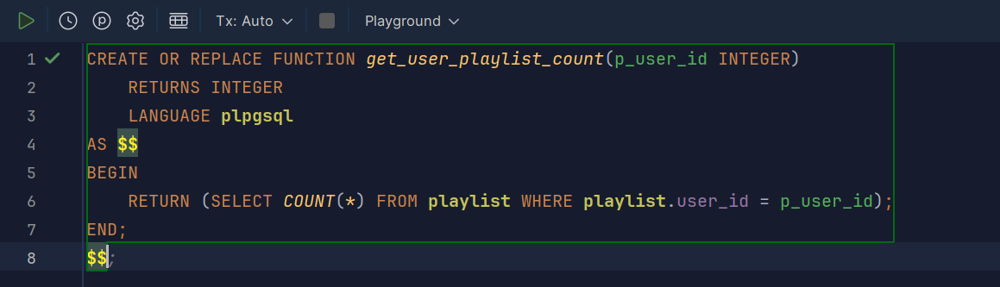

## 6. Функция для получения количества треков в альбоме

Функция `get_album_track_count` возвращает количество треков в указанном альбоме.

```sql
CREATE OR REPLACE FUNCTION get_album_track_count(p_album_id INTEGER)
RETURNS INTEGER
LANGUAGE plpgsql
AS $$
BEGIN
    RETURN (SELECT COUNT(*) FROM track WHERE track.album_id = p_album_id);
END;
$$
```

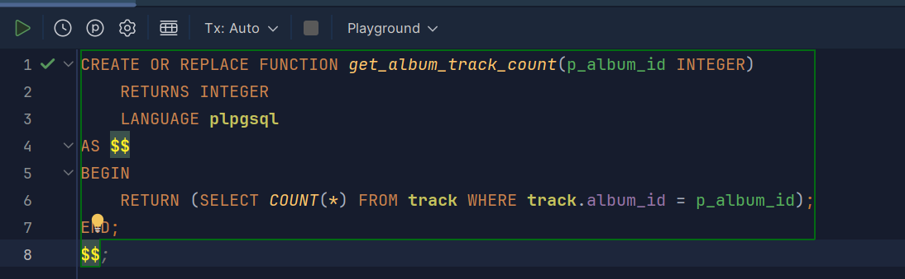

## 7. Функция для получения количества альбомов артиста

Функция `get_artist_album_count` возвращает количество альбомов, выпущенных артистом.

```sql
CREATE OR REPLACE FUNCTION get_artist_album_count(p_artist_id INTEGER)
RETURNS INTEGER
LANGUAGE plpgsql
AS $$
BEGIN
    RETURN (SELECT COUNT(*) FROM album WHERE album.artist_id = p_artist_id);
END;
$$
```

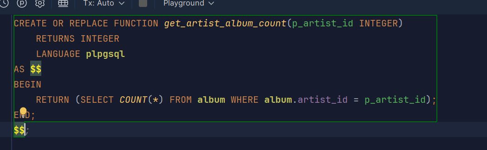

## Функции с использованием переменных

## 8. Функция для подсчета общего времени прослушивания пользователя

Функция `get_user_total_listening_time` вычисляет и возвращает общее время в секундах, которое пользователь потратил на прослушивание треков.

```sql
CREATE OR REPLACE FUNCTION get_user_total_listening_time(p_user_id INTEGER)
RETURNS INTEGER
LANGUAGE plpgsql
AS $$
DECLARE
    total_duration INTEGER;
BEGIN
    SELECT SUM(t.duration_seconds)
    INTO total_duration
    FROM listening_history lh
    JOIN track t ON lh.track_id = t.id
    WHERE lh.user_id = p_user_id;

    RETURN COALESCE(total_duration, 0);
END;
$$
```

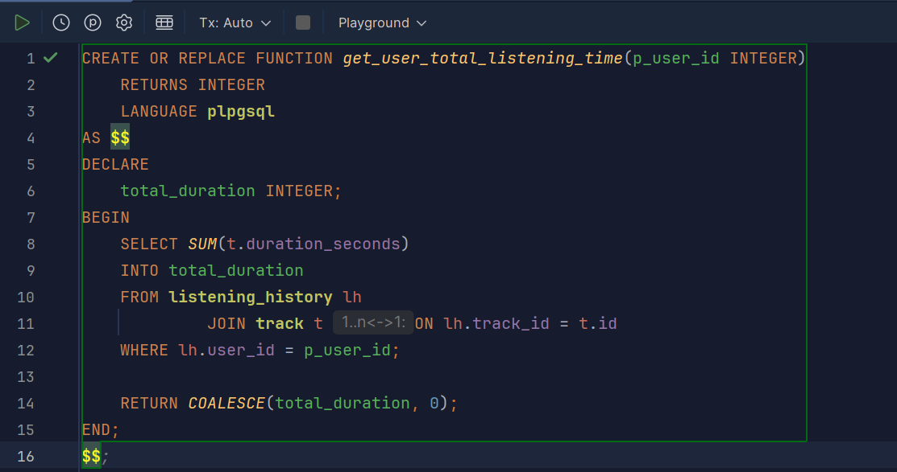

## 9. Функция для подсчета всех треков артиста

Функция `get_artist_track_count` возвращает общее количество треков, созданных артистом.

```sql
CREATE OR REPLACE FUNCTION get_artist_track_count(p_artist_id INTEGER)
RETURNS INTEGER
LANGUAGE plpgsql
AS $$
DECLARE
    track_count INTEGER;
BEGIN
    SELECT COUNT(*)
    INTO track_count
    FROM track
    WHERE track.artist_id = p_artist_id;

    RETURN track_count;
END;
$$
```

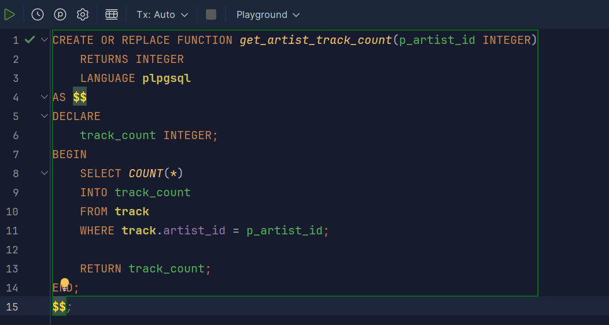

## 10. Функция для проверки, лайкнул ли пользователь трек

Функция `check_if_user_liked_track` возвращает `TRUE`, если пользователь поставил лайк треку, и `FALSE` в противном случае.

```sql
CREATE OR REPLACE FUNCTION check_if_user_liked_track(p_user_id INTEGER, p_track_id INTEGER)
RETURNS BOOLEAN
LANGUAGE plpgsql
AS $$
DECLARE
    has_liked BOOLEAN;
BEGIN
    SELECT EXISTS (
        SELECT 1
        FROM "like"
        WHERE "like".user_id = p_user_id AND "like".track_id = p_track_id
    )
    INTO has_liked;

    RETURN has_liked;
END;
$$
```

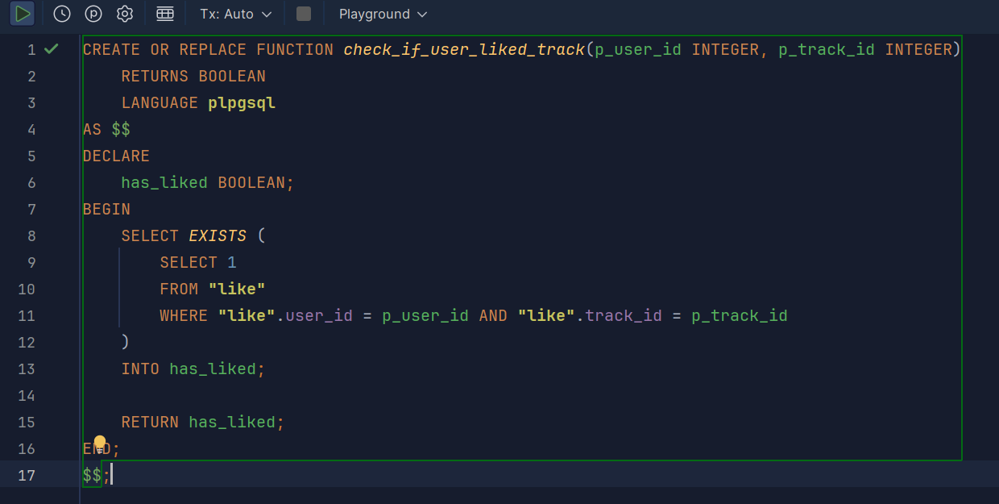

## Блок DO

### 1. Простой анонимный блок
Выводит информационное сообщение.
```sql
DO $$
BEGIN
    RAISE NOTICE 'Это анонимный блок.';
END;
$$
```

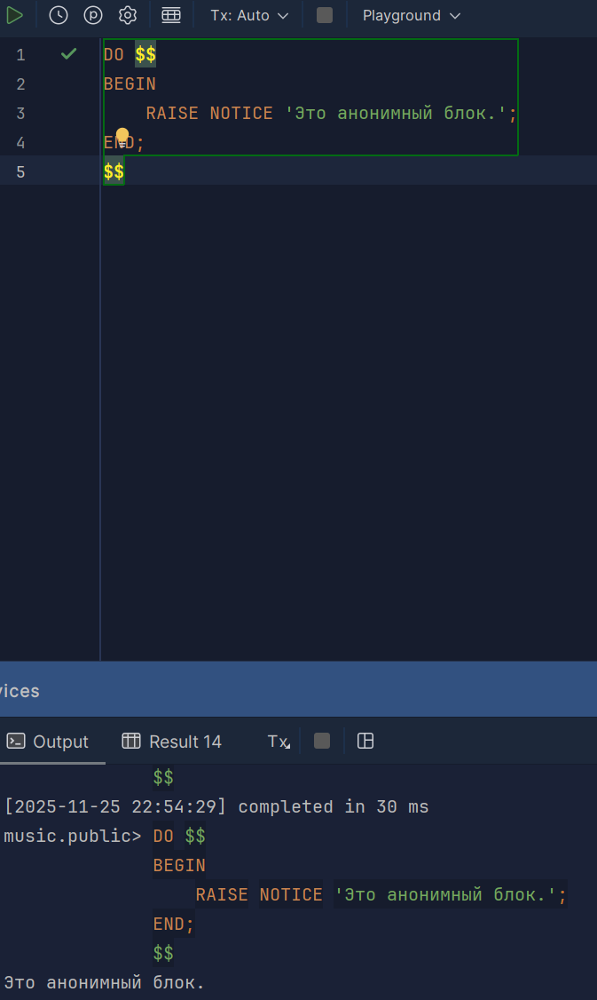

### 2. Вставка данных
Добавляет новый жанр 'Ambient', если он еще не существует.
```sql
DO $$
BEGIN
    IF NOT EXISTS (SELECT 1 FROM genre WHERE name = 'Ambient') THEN
        INSERT INTO genre (name) VALUES ('Ambient');
        RAISE NOTICE 'Жанр Ambient добавлен.';
    END IF;
END;
$$
```

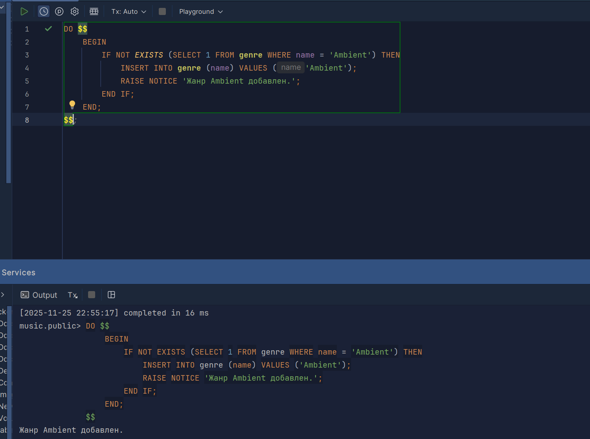

### 3. Обновление данных
Обновляет цену на 'Premium' подписку.
```sql
DO $$
BEGIN
    UPDATE subscription SET price = 10.99 WHERE name = 'Premium';
    RAISE NOTICE 'Цена на Premium подписку обновлена.';
END;
$$
```

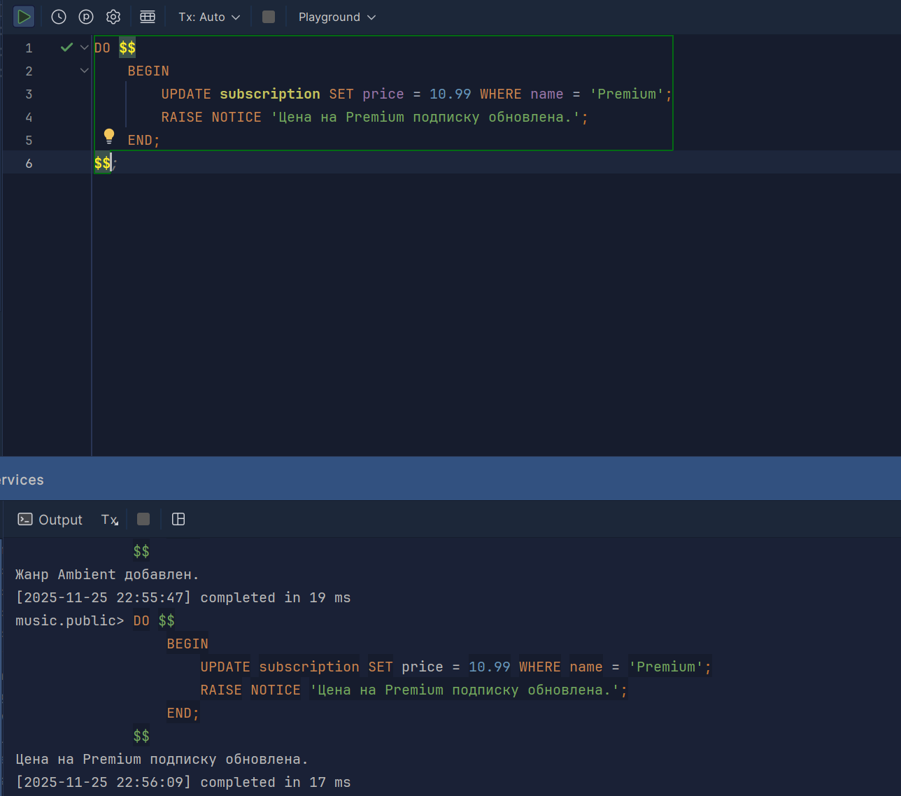

## Условный оператор IF

### 1. Проверка статуса подписки пользователя
Процедура проверяет, есть ли у пользователя платная подписка, и выводит соответствующее сообщение.
```sql
CREATE OR REPLACE PROCEDURE check_user_subscription(p_user_id INTEGER)
LANGUAGE plpgsql
AS $$
DECLARE
    sub_price DECIMAL;
BEGIN
    SELECT s.price INTO sub_price
    FROM "user" u
    JOIN subscription s ON u.subscription_id = s.id
    WHERE u.id = p_user_id;

    IF sub_price > 0 THEN
        RAISE NOTICE 'У пользователя ID % платная подписка.', p_user_id;
    ELSE
        RAISE NOTICE 'У пользователя ID % бесплатная подписка.', p_user_id;
    END IF;
END;
$$
```
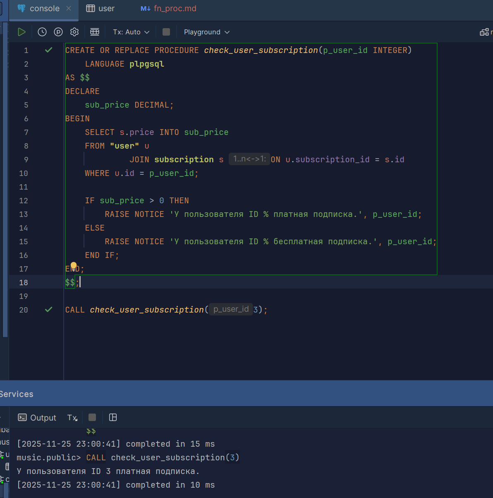

## Условный оператор CASE

### 1. Категоризация длительности трека
Функция возвращает текстовую категорию длительности трека.
```sql
CREATE OR REPLACE FUNCTION get_track_duration_category(p_track_id INTEGER)
RETURNS TEXT
LANGUAGE plpgsql
AS $$
DECLARE
    duration INTEGER;
    category TEXT;
BEGIN
    SELECT duration_seconds INTO duration FROM track WHERE id = p_track_id;

    CASE
        WHEN duration < 180 THEN
            category := 'Короткий';
        WHEN duration BETWEEN 180 AND 300 THEN
            category := 'Средний';
        ELSE
            category := 'Длинный';
    END CASE;

    RETURN category;
END;
$$
```

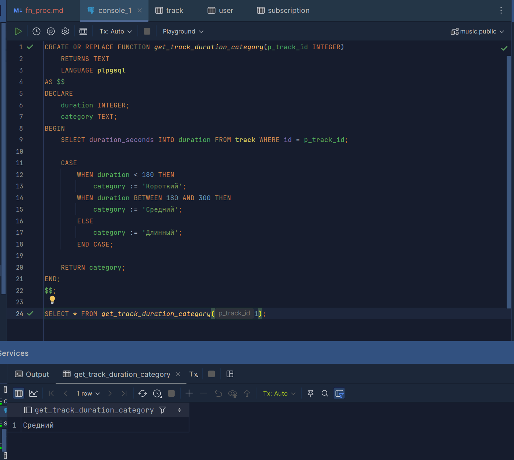

## Цикл WHILE

### 1. Простой цикл
Выводит числа от 1 до 5.
```sql
DO $$
DECLARE
    counter INTEGER := 1;
BEGIN
    WHILE counter <= 5 LOOP
        RAISE NOTICE 'Счетчик: %', counter;
        counter := counter + 1;
    END LOOP;
END;
$$
```

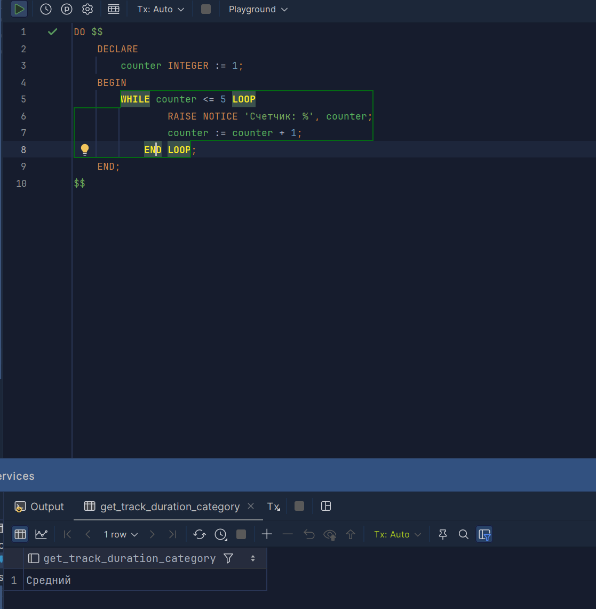

### 2. Удаление старых записей
Процедура удаляет записи из истории прослушиваний, которые старше 2 лет, пакетами по 1000 штук.
```sql
CREATE OR REPLACE PROCEDURE cleanup_old_history()
LANGUAGE plpgsql
AS $$
DECLARE
    rows_deleted INTEGER;
BEGIN
    LOOP
        DELETE FROM listening_history
        WHERE id IN (
            SELECT id FROM listening_history
            WHERE listened_at < NOW() - INTERVAL '2 year'
            LIMIT 1000
        );
        GET DIAGNOSTICS rows_deleted = ROW_COUNT;
        EXIT WHEN rows_deleted = 0;
        RAISE NOTICE 'Удалено % старых записей.', rows_deleted;
    END LOOP;
END;
$$
```

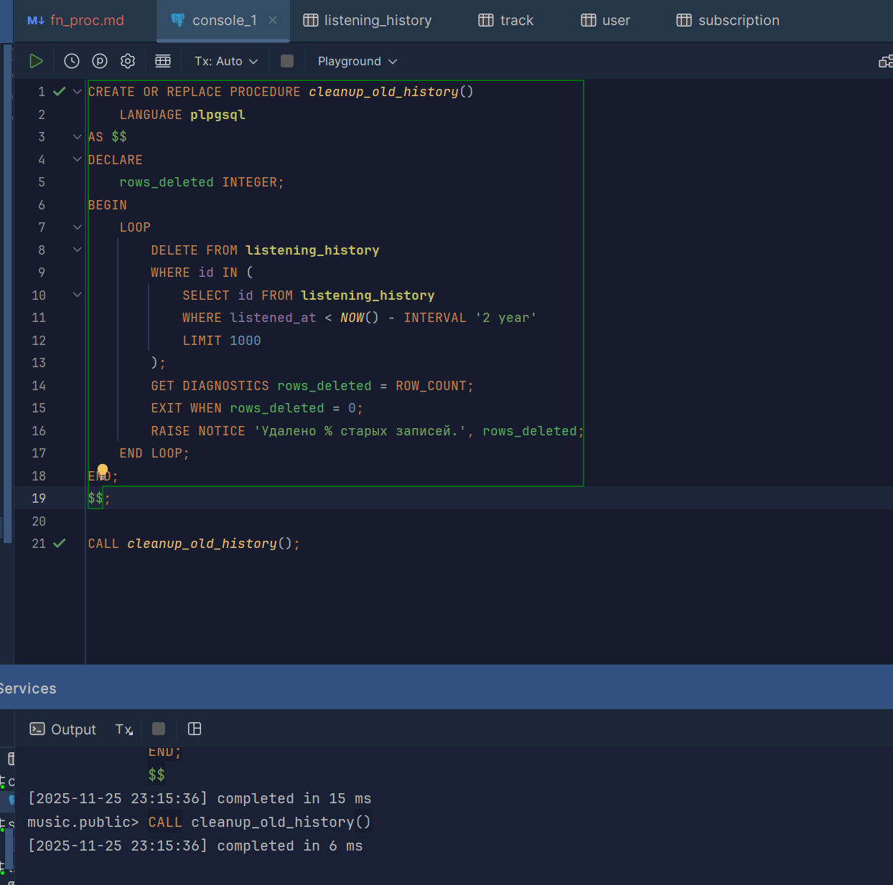

## Обработка исключений EXCEPTION

### 1. Перехват деления на ноль
Функция пытается разделить 10 на 0 и перехватывает исключение.
```sql
CREATE OR REPLACE FUNCTION safe_divide(
    p_numerator INTEGER,
    p_denominator INTEGER
)
RETURNS INTEGER
LANGUAGE plpgsql
AS $$
BEGIN
RETURN p_numerator / p_denominator;
EXCEPTION
    WHEN division_by_zero THEN
        RAISE NOTICE 'Ошибка: деление на ноль!';
RETURN NULL;
END;
$$;
```

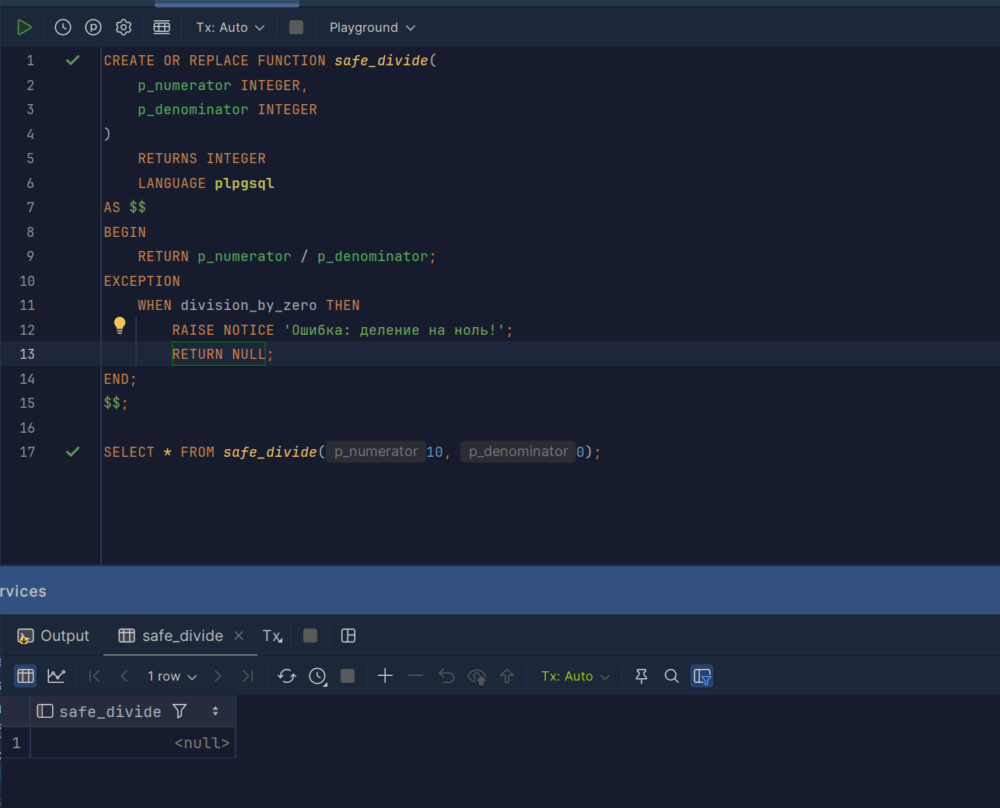

### 2. Перехват нарушения уникальности
Процедура пытается вставить жанр, который уже существует, и перехватывает исключение.
```sql
CREATE OR REPLACE PROCEDURE add_genre_safely(p_genre_name VARCHAR)
LANGUAGE plpgsql
AS $$
BEGIN
    INSERT INTO genre (name) VALUES (p_genre_name);
    RAISE NOTICE 'Жанр ''%'' успешно добавлен.', p_genre_name;
EXCEPTION
    WHEN unique_violation THEN
        RAISE NOTICE 'Ошибка: жанр ''%'' уже существует.', p_genre_name;
END;
$$
```

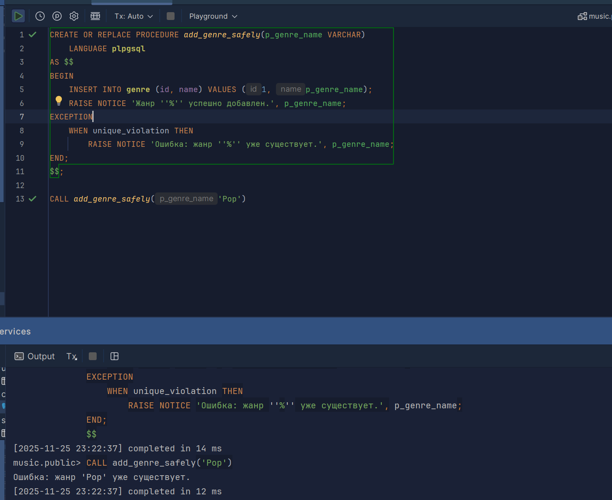

## Генерация ошибок RAISE

### 1. Использование RAISE NOTICE
Функция выводит отладочное сообщение с информацией о треке.
```sql
CREATE OR REPLACE FUNCTION get_track_info_debug(p_track_id INTEGER)
RETURNS TEXT
LANGUAGE plpgsql
AS $$
DECLARE
    track_title TEXT;
BEGIN
    SELECT title INTO track_title FROM track WHERE id = p_track_id;
    RAISE NOTICE 'Получение информации для трека ID %', p_track_id;
    RETURN track_title;
END;
$$
```

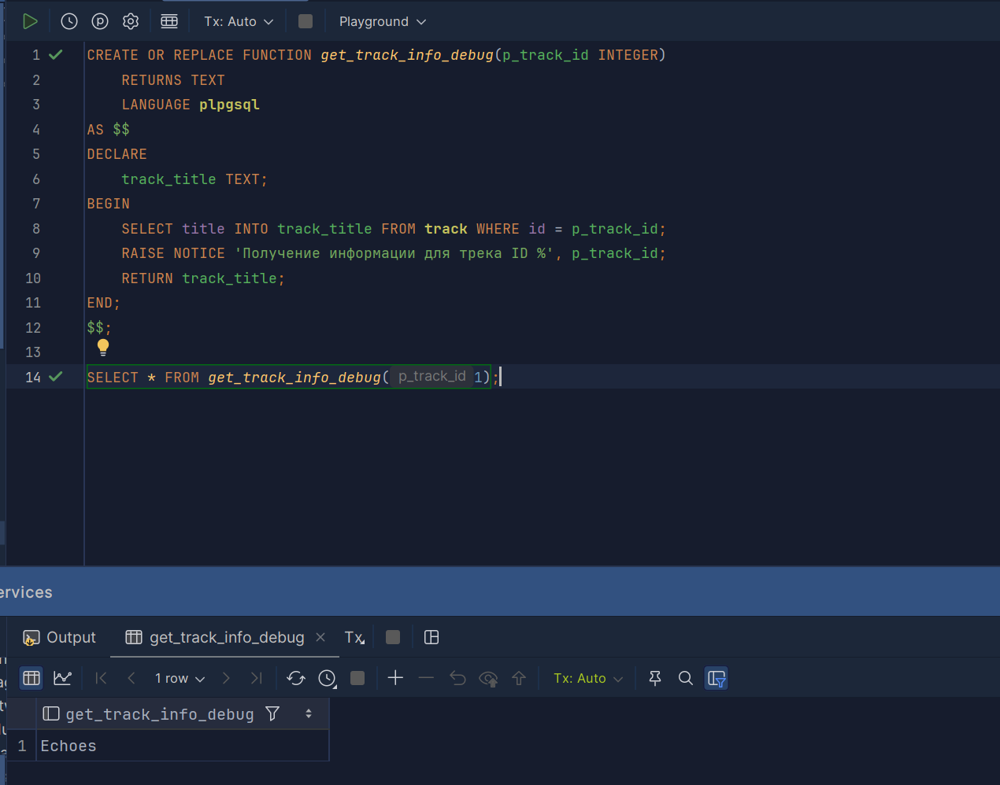

### 2. Использование RAISE EXCEPTION
Процедура для обновления длительности трека, которая вызывает исключение, если новое значение отрицательное.
```sql
CREATE OR REPLACE PROCEDURE update_track_duration(p_track_id INTEGER, new_duration INTEGER)
LANGUAGE plpgsql
AS $$
BEGIN
    IF new_duration < 0 THEN
        RAISE EXCEPTION 'Длительность трека не может быть отрицательной. Получено: %', new_duration;
    END IF;

    UPDATE track SET duration_seconds = new_duration WHERE id = p_track_id;
    RAISE NOTICE 'Длительность трека ID % обновлена.', p_track_id;
END;
$$
```
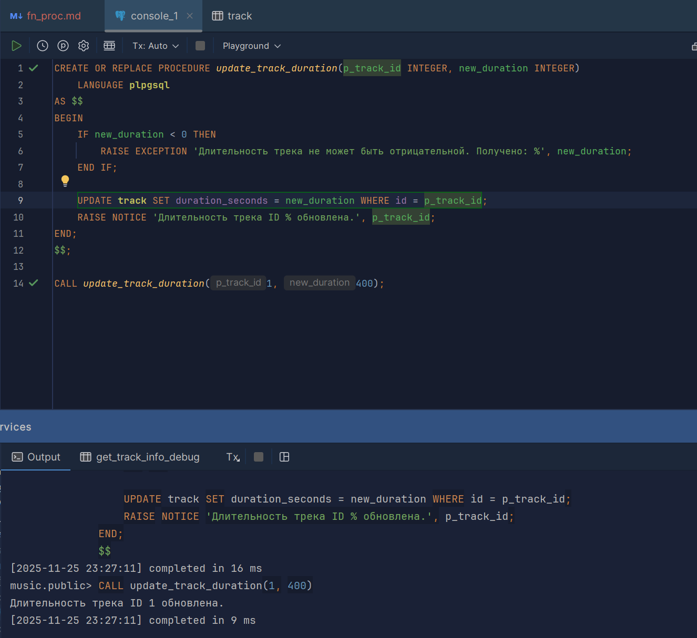

## Получение всех процедур и функций

```sql
-- Получить все функции
SELECT routine_name, routine_type
FROM information_schema.routines
WHERE routine_type = 'FUNCTION'
  AND routine_schema NOT IN ('pg_catalog', 'information_schema');
```

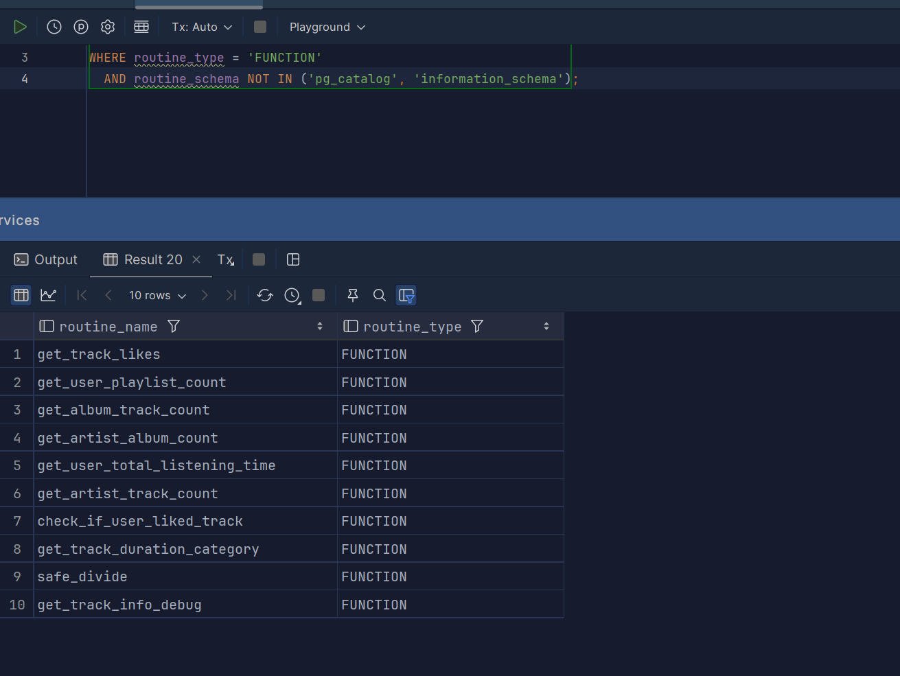