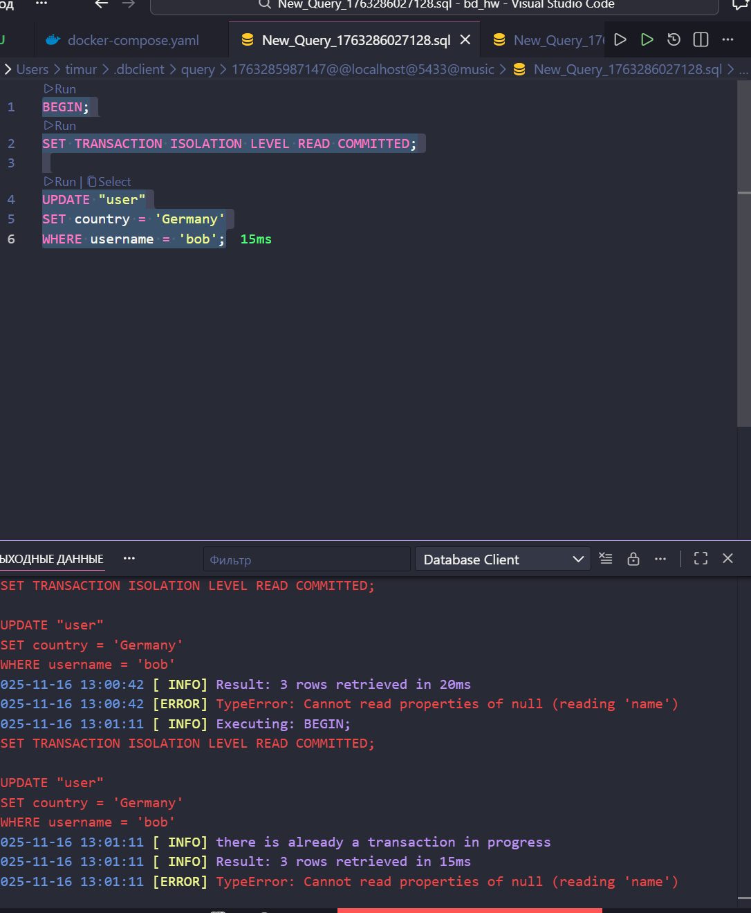
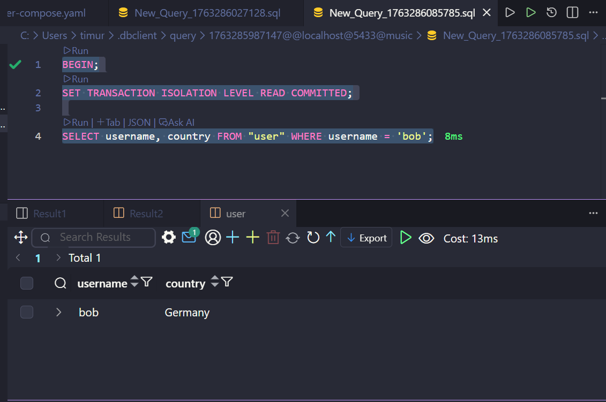
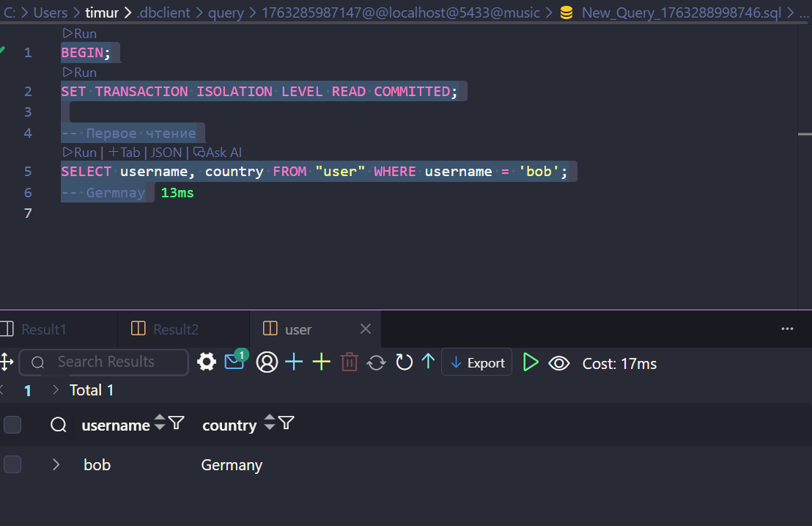
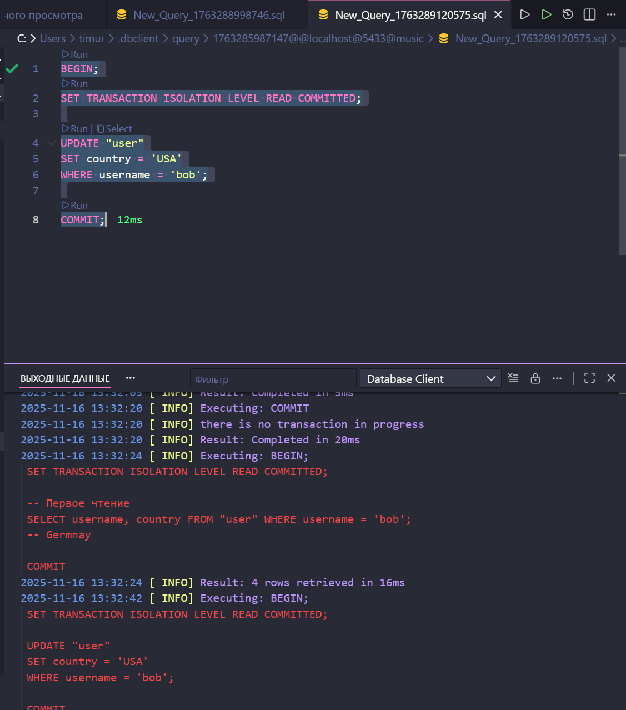
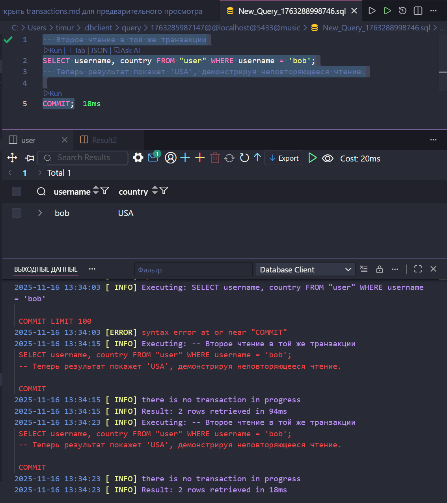

## 1. Транзакция BEGIN ... COMMIT

Эта транзакция добавит новую подписку, а затем обновит пользователя, чтобы он использовал эту новую подписку.

```sql
BEGIN;

INSERT INTO subscription (name, price, duration_months)
VALUES ('Pro', 19.99, 3)
RETURNING id; -- Получаем ID новой подписки

UPDATE "user"
SET subscription_id = 4
WHERE username = 'Timur';

COMMIT;
```


## 2. Транзакция BEGIN ... ROLLBACK

Эта транзакция попытается добавить новую подписку и обновить пользователя, но затем откатит все изменения.


```sql
BEGIN;

INSERT INTO subscription (name, price, duration_months)
VALUES ('Trial', 0.00, 1)
RETURNING id;

UPDATE "user"
SET subscription_id = 5
WHERE username = 'charlie';

ROLLBACK;
```


## 3. Транзакция с ошибкой

Эта транзакция будет содержать преднамеренную ошибку (деление на ноль), чтобы продемонстрировать автоматический откат в PostgreSQL.

```sql
BEGIN;

INSERT INTO subscription (name, price, duration_months)
VALUES ('Premium Plus', 29.99, 12);

SELECT 1 / 0;

UPDATE "user"
SET subscription_id = 6
WHERE username = 'charlie';

COMMIT;
```


Запись не изменилась, подписка не добавилась

---

# Уровни изоляции

## Грязное чтение (Dirty Read - READ UNCOMMITTED / READ COMMITTED)

В PostgreSQL уровень изоляции `READ UNCOMMITTED` реализован так же, как `READ COMMITTED`. Это означает, что мы не можем видеть "грязные" данные (данные, которые были изменены, но еще не зафиксированы).

Вот как это можно проверить. Нам понадобятся два отдельных подключения к базе данных, представляющие Транзакцию 1 (T1) и Транзакцию 2 (T2).

**Транзакция 1 (T1):**
```sql
BEGIN;
SET TRANSACTION ISOLATION LEVEL READ COMMITTED;

UPDATE "user"
SET country = 'Germany'
WHERE username = 'bob';

-- Оставляем эту транзакцию открытой и переключаемся на T2
```

**Транзакция 2 (T2):**
```sql
BEGIN;
SET TRANSACTION ISOLATION LEVEL READ COMMITTED;

SELECT username, country FROM "user" WHERE username = 'bob';

COMMIT;
```




НЕ УДАЛОСЬ ПРОВЕРИТЬ В СУРОВЫХ УСЛОВИЯХ VS CODE

## Неповторяющееся чтение (Non-Repeatable Read - READ COMMITTED)

Этот сценарий демонстрирует, что с уровнем изоляции `READ COMMITTED`, если вы читаете одни и те же данные дважды в одной и той же транзакции, вы можете получить разные результаты, если другая транзакция изменяет и фиксирует эти данные между вашими чтениями.

**Транзакция 1 (T1):**
```sql
BEGIN;
SET TRANSACTION ISOLATION LEVEL READ COMMITTED;

-- Первое чтение
SELECT username, country FROM "user" WHERE username = 'bob';
-- Germnay
```

**Транзакция 2 (T2):**
```sql
BEGIN;
SET TRANSACTION ISOLATION LEVEL READ COMMITTED;

UPDATE "user"
SET country = 'USA'
WHERE username = 'bob';

COMMIT;
```

**Транзакция 1 (T1) - Продолжение:**
```sql
-- Второе чтение в той же транзакции
SELECT username, country FROM "user" WHERE username = 'bob';
-- Теперь результат покажет 'USA', демонстрируя неповторяющееся чтение.

COMMIT;
```





## Повторяемое чтение (Repeatable Read)

Этот уровень гарантирует, что если вы читаете одни и те же данные несколько раз в рамках одной транзакции, вы получите один и тот же результат. Он предотвращает неповторяющиеся чтения.

**Транзакция 1 (T1):**
```sql
BEGIN;
SET TRANSACTION ISOLATION LEVEL REPEATABLE READ;

-- Первое чтение
SELECT username, country FROM "user" WHERE username = 'bob';
-- Результат: 'Germany'

-- Оставляем эту транзакцию открытой и выполняем T2
```

**Транзакция 2 (T2):**
```sql
BEGIN;
SET TRANSACTION ISOLATION LEVEL REPEATABLE READ;

-- Обновляем страну для 'bob' и фиксируем изменения
UPDATE "user"
SET country = 'Canada'
WHERE username = 'bob';

COMMIT;
```

**Транзакция 1 (T1) - Продолжение:**
```sql
-- Второе чтение
SELECT username, country FROM "user" WHERE username = 'bob';
-- Результат по-прежнему 'USA'. T1 не видит зафиксированные изменения из T2.

COMMIT;
```


## Фантомное чтение (Phantom Read - REPEATABLE READ)

Хотя `REPEATABLE READ` предотвращает изменение существующих строк, он все еще может страдать от фантомных чтений, когда становятся видимыми новые строки, вставленные другой транзакцией.

**Транзакция 1 (T1):**
```sql
BEGIN;
SET TRANSACTION ISOLATION LEVEL REPEATABLE READ;

-- Считаем пользователей из Канады
SELECT COUNT(*) FROM "user" WHERE country = 'Canada';
-- Результат: 0 (предполагая, что изначально пользователей из Канады нет)

-- Оставляем эту транзакцию открытой и выполняем T2
```

**Транзакция 2 (T2):**
```sql
BEGIN;
SET TRANSACTION ISOLATION LEVEL REPEATABLE READ;

-- Вставляем нового пользователя из Канады
INSERT INTO "user" (email, username, password_hash, country, date_joined, subscription_id)
VALUES ('newuser@mail.com', 'NewUser', 'hash3', 'Canada', '2024-03-20', 1);

COMMIT;
```

**Транзакция 1 (T1) - Продолжение:**
```sql
-- Снова считаем пользователей из Канады
SELECT COUNT(*) FROM "user" WHERE country = 'Canada';
-- Теперь результат равен 1. Появилась "фантомная" строка.

COMMIT;
```

## Serializable

Это самый высокий уровень изоляции. Он предотвращает неповторяющиеся чтения, фантомные чтения и аномалии сериализации.

**Пример конфликта сериализации:**

**Транзакция 1 (T1):**
```sql
BEGIN;
SET TRANSACTION ISOLATION LEVEL SERIALIZABLE;

-- Пытаемся вставить нового исполнителя
INSERT INTO artist (name, country, description, user_id, start_year)
VALUES ('The Void', 'UK', 'Electronic Duo', 1, 2020);

-- Оставляем эту транзакцию открытой и выполняем T2
```

**Транзакция 2 (T2):**
```sql
BEGIN;
SET TRANSACTION ISOLATION LEVEL SERIALIZABLE;

-- Пытаемся вставить того же исполнителя
INSERT INTO artist (name, country, description, user_id, start_year)
VALUES ('The Void', 'UK', 'Electronic Duo', 1, 2020);

-- Эта транзакция может ожидать. Теперь зафиксируем T1.
```

**Транзакция 1 (T1) - Продолжение:**
```sql
COMMIT;
```

**Транзакция 2 (T2) - Результат:**
После фиксации T1, T2 завершится с ошибкой, подобной этой:
`ERROR: could not serialize access due to concurrent update`
Это происходит потому, что операция T2 зависит от состояния, которое изменила T1. T2 затем автоматически откатывается. Чтобы добиться успеха, вам нужно будет повторить транзакцию.

---

# SAVEPOINT

## Одна точка сохранения и откат

Этот пример показывает, как выполнить некоторые операции, создать точку сохранения, выполнить еще операции, а затем откатить только те изменения, которые были сделаны после точки сохранения.

```sql
BEGIN;

-- Меняем страну Тимура на Японию
UPDATE "user" SET country = 'Japan' WHERE username = 'Timur';

SAVEPOINT my_savepoint;

-- Меняем страну Амира на Бразилию
UPDATE "user" SET country = 'Brazil' WHERE username = 'Amir';

-- Проверяем текущее состояние
SELECT username, country FROM "user" WHERE username IN ('Timur', 'Amir');
-- Результат: Тимур в Японии, Амир в Бразилии

-- Теперь откатываемся к точке сохранения
ROLLBACK TO SAVEPOINT my_savepoint;

-- Снова проверяем состояние
SELECT username, country FROM "user" WHERE username IN ('Timur', 'Amir');
-- Результат: Тимур в Японии, страна Амира возвращена к предыдущему состоянию.

COMMIT;
-- Изменение страны Тимура будет сохранено.
```

## Несколько точек сохранения

Этот пример демонстрирует создание нескольких точек сохранения и откат к ним.

```sql
BEGIN;

-- Первоначальное обновление
UPDATE "user" SET country = 'Australia' WHERE username = 'Timur';
SAVEPOINT sp1;

-- Второе обновление
UPDATE "user" SET country = 'Mexico' WHERE username = 'Amir';
SAVEPOINT sp2;

-- Третье обновление
UPDATE "user" SET phone_number = '+111111111' WHERE username = 'Timur';

-- Проверяем текущее состояние
SELECT username, country, phone_number FROM "user" WHERE username IN ('Timur', 'Amir');
-- Результат: Тимур в Австралии с новым номером телефона, Амир в Мексике.

-- Откатываемся ко второй точке сохранения
ROLLBACK TO SAVEPOINT sp2;

-- Проверяем состояние после отката к sp2
SELECT username, country, phone_number FROM "user" WHERE username IN ('Timur', 'Amir');
-- Результат: Изменение номера телефона Тимура отменено. Он все еще в Австралии. Амир все еще в Мексике.

-- Теперь откатываемся к первой точке сохранения
ROLLBACK TO SAVEPOINT sp1;

-- Проверяем состояние после отката к sp1
SELECT username, country, phone_number FROM "user" WHERE username IN ('Timur', 'Amir');
-- Результат: Изменение страны Амира отменено. Тимур все еще в Австралии.

COMMIT;
-- Будет сохранено только первое изменение (страна Тимура на Австралию).
```

## 2. BEGIN ... ROLLBACK Transaction

This transaction will attempt to add a new subscription and update a user, but then roll back all changes.

```sql
BEGIN;

INSERT INTO subscription (name, price, duration_months)
VALUES ('Trial', 0.00, 1)
RETURNING id;

-- Assuming the new subscription ID is 5 (adjust if necessary based on your data)
UPDATE "user"
SET subscription_id = 5
WHERE username = 'Amir';

ROLLBACK;
```

## 3. Transaction with an Error

This transaction will include an intentional error (division by zero) to demonstrate automatic rollback by PostgreSQL.

```sql
BEGIN;

INSERT INTO subscription (name, price, duration_months)
VALUES ('Premium Plus', 29.99, 12);

SELECT 1 / 0; -- This will cause an error

UPDATE "user"
SET subscription_id = (SELECT id FROM subscription WHERE name = 'Premium Plus')
WHERE username = 'Timur';

COMMIT;
```

---

# Isolation Levels

## Dirty Read (READ UNCOMMITTED / READ COMMITTED)

In PostgreSQL, the `READ UNCOMMITTED` isolation level is implemented identically to `READ COMMITTED`. This means you cannot see "dirty" data (data that has been modified but not yet committed).

Here is how you can test this. You will need two separate connections to the database, representing Transaction 1 (T1) and Transaction 2 (T2).

**Transaction 1 (T1):**
```sql
BEGIN;
SET TRANSACTION ISOLATION LEVEL READ COMMITTED;

-- Update a user's country but do not commit
UPDATE "user"
SET country = 'Germany'
WHERE username = 'Timur';

-- Keep this transaction open and switch to T2
```

**Transaction 2 (T2):**
```sql
BEGIN;
SET TRANSACTION ISOLATION LEVEL READ COMMITTED;

-- Try to read the user's country
-- You will see the old value ('China' or 'Russia'), not 'Germany', because T1 has not committed.
SELECT username, country FROM "user" WHERE username = 'Timur';

COMMIT;
```
Now, go back to T1 and `COMMIT` the change. If you run the `SELECT` query in T2 again (in a new transaction), you will see the updated value 'Germany'.

## Non-Repeatable Read (READ COMMITTED)

This scenario demonstrates that with the `READ COMMITTED` isolation level, if you read the same data twice in the same transaction, you may get different results if another transaction modifies and commits that data in between your reads.

**Transaction 1 (T1):**
```sql
BEGIN;
SET TRANSACTION ISOLATION LEVEL READ COMMITTED;

-- First read
SELECT username, country FROM "user" WHERE username = 'Amir';
-- The result will show the current country, e.g., 'Russia'

-- Now, keep this transaction open and execute T2
```

**Transaction 2 (T2):**
```sql
BEGIN;
SET TRANSACTION ISOLATION LEVEL READ COMMITTED;

-- Update the country for the user 'Amir' and commit
UPDATE "user"
SET country = 'USA'
WHERE username = 'Amir';

COMMIT;
```

**Transaction 1 (T1) - Continued:**
```sql
-- Second read within the same transaction
SELECT username, country FROM "user" WHERE username = 'Amir';
-- The result will now show 'USA', demonstrating a non-repeatable read.

COMMIT;
```

## Repeatable Read

This level ensures that if you read the same data multiple times within a transaction, you will get the same result. It prevents non-repeatable reads.

**Transaction 1 (T1):**
```sql
BEGIN;
SET TRANSACTION ISOLATION LEVEL REPEATABLE READ;

-- First read
SELECT username, country FROM "user" WHERE username = 'Amir';
-- Result: 'USA'

-- Keep this transaction open and execute T2
```

**Transaction 2 (T2):**
```sql
BEGIN;
SET TRANSACTION ISOLATION LEVEL REPEATABLE READ;

-- Update the country for 'Amir' and commit
UPDATE "user"
SET country = 'Canada'
WHERE username = 'Amir';

COMMIT;
```

**Transaction 1 (T1) - Continued:**
```sql
-- Second read
SELECT username, country FROM "user" WHERE username = 'Amir';
-- Result is still 'USA'. T1 does not see the committed change from T2.

COMMIT;
```

## Phantom Read (REPEATABLE READ)

While `REPEATABLE READ` prevents modification of existing rows, it can still suffer from phantom reads, where new rows inserted by another transaction become visible.

**Transaction 1 (T1):**
```sql
BEGIN;
SET TRANSACTION ISOLATION LEVEL REPEATABLE READ;

-- Count users from Canada
SELECT COUNT(*) FROM "user" WHERE country = 'Canada';
-- Result: 0 (assuming no users are from Canada initially)

-- Keep this transaction open and execute T2
```

**Transaction 2 (T2):**
```sql
BEGIN;
SET TRANSACTION ISOLATION LEVEL REPEATABLE READ;

-- Insert a new user from Canada
INSERT INTO "user" (email, username, password_hash, country, date_joined, subscription_id)
VALUES ('newuser@mail.com', 'NewUser', 'hash3', 'Canada', '2024-03-20', 1);

COMMIT;
```

**Transaction 1 (T1) - Continued:**
```sql
-- Count users from Canada again
SELECT COUNT(*) FROM "user" WHERE country = 'Canada';
-- Result is now 1. A "phantom" row has appeared.

COMMIT;
```

## Serializable

This is the highest isolation level. It prevents non-repeatable reads, phantom reads, and serialization anomalies.

**Serialization Conflict Example:**

**Transaction 1 (T1):**
```sql
BEGIN;
SET TRANSACTION ISOLATION LEVEL SERIALIZABLE;

-- Try to insert a new artist
INSERT INTO artist (name, country, description, user_id, start_year)
VALUES ('The Void', 'UK', 'Electronic Duo', 1, 2020);

-- Keep this transaction open and execute T2
```

**Transaction 2 (T2):**
```sql
BEGIN;
SET TRANSACTION ISOLATION LEVEL SERIALIZABLE;

-- Try to insert the same artist
INSERT INTO artist (name, country, description, user_id, start_year)
VALUES ('The Void', 'UK', 'Electronic Duo', 1, 2020);

-- This transaction might wait. Now, commit T1.
```

**Transaction 1 (T1) - Continued:**
```sql
COMMIT;
```

**Transaction 2 (T2) - Result:**
After T1 commits, T2 will fail with an error similar to:
`ERROR: could not serialize access due to concurrent update`
This happens because T2's operation depends on a state that T1 has changed. T2 is then rolled back automatically. To succeed, you would need to retry the transaction.

---

# SAVEPOINT

## Single Savepoint and Rollback

This example shows how to perform some operations, create a savepoint, perform more operations, and then roll back only the changes made after the savepoint.

```sql
BEGIN;

-- Change Timur's country to Japan
UPDATE "user" SET country = 'Japan' WHERE username = 'Timur';

SAVEPOINT my_savepoint;

-- Change Amir's country to Brazil
UPDATE "user" SET country = 'Brazil' WHERE username = 'Amir';

-- Check the current state
SELECT username, country FROM "user" WHERE username IN ('Timur', 'Amir');
-- Result: Timur is in Japan, Amir is in Brazil

-- Now, roll back to the savepoint
ROLLBACK TO SAVEPOINT my_savepoint;

-- Check the state again
SELECT username, country FROM "user" WHERE username IN ('Timur', 'Amir');
-- Result: Timur is in Japan, Amir's country has been reverted to its previous state.

COMMIT;
-- The change to Timur's country will be saved.
```

## Multiple Savepoints

This example demonstrates creating multiple savepoints and rolling back to them.

```sql
BEGIN;

-- Initial update
UPDATE "user" SET country = 'Australia' WHERE username = 'Timur';
SAVEPOINT sp1;

-- Second update
UPDATE "user" SET country = 'Mexico' WHERE username = 'Amir';
SAVEPOINT sp2;

-- Third update
UPDATE "user" SET phone_number = '+111111111' WHERE username = 'Timur';

-- Check current state
SELECT username, country, phone_number FROM "user" WHERE username IN ('Timur', 'Amir');
-- Result: Timur is in Australia with a new phone number, Amir is in Mexico.

-- Roll back to the second savepoint
ROLLBACK TO SAVEPOINT sp2;

-- Check state after rolling back to sp2
SELECT username, country, phone_number FROM "user" WHERE username IN ('Timur', 'Amir');
-- Result: Timur's phone number change is reverted. He is still in Australia. Amir is still in Mexico.

-- Now, roll back to the first savepoint
ROLLBACK TO SAVEPOINT sp1;

-- Check state after rolling back to sp1
SELECT username, country, phone_number FROM "user" WHERE username IN ('Timur', 'Amir');
-- Result: Amir's country change is reverted. Timur is still in Australia.

COMMIT;
-- Only the first change (Timur's country to Australia) will be saved.
