## 1. Транзакция BEGIN ... COMMIT

Эта транзакция добавит новую подписку, а затем обновит пользователя, чтобы он использовал эту новую подписку.

```sql
BEGIN;

INSERT INTO subscription (name, price, duration_months)
VALUES ('Pro', 19.99, 3)
RETURNING id; -- Получаем ID новой подписки

UPDATE "user"
SET subscription_id = 4
WHERE username = 'Timur';

COMMIT;
```

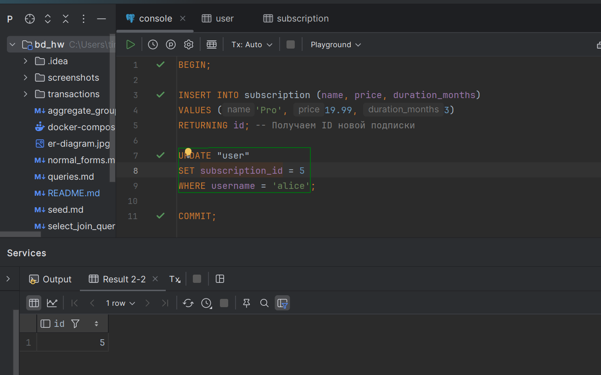

## 2. Транзакция BEGIN ... ROLLBACK

Эта транзакция попытается добавить новую подписку и обновить пользователя, но затем откатит все изменения.


```sql
BEGIN;

INSERT INTO subscription (name, price, duration_months)
VALUES ('Trial', 0.00, 1)
RETURNING id;

UPDATE "user"
SET subscription_id = 5
WHERE username = 'charlie';

ROLLBACK;
```

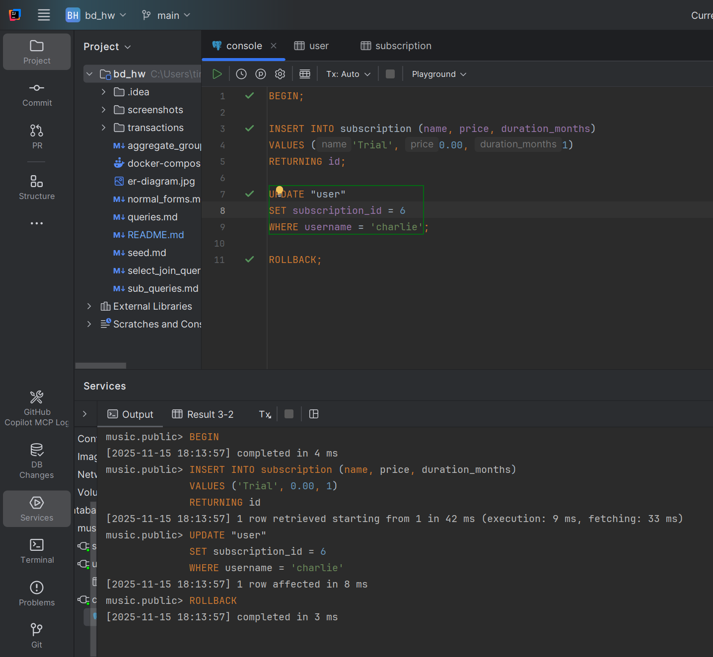

## 3. Транзакция с ошибкой

Эта транзакция будет содержать преднамеренную ошибку (деление на ноль), чтобы продемонстрировать автоматический откат в PostgreSQL.

```sql
BEGIN;

INSERT INTO subscription (name, price, duration_months)
VALUES ('Premium Plus', 29.99, 12);

SELECT 1 / 0;

UPDATE "user"
SET subscription_id = 6
WHERE username = 'charlie';

COMMIT;
```

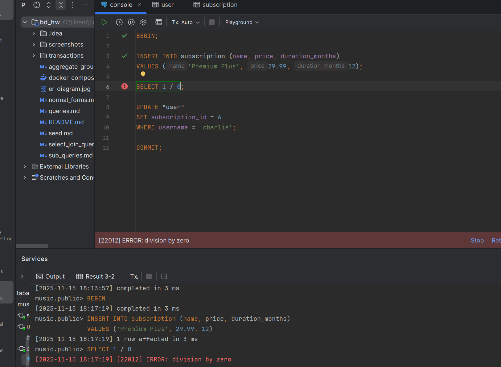
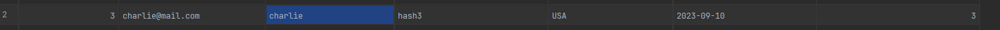
Запись не изменилась, подписка не добавилась

---

# Уровни изоляции

## Грязное чтение (Dirty Read - READ UNCOMMITTED / READ COMMITTED)

В PostgreSQL нет уровня изоляции `READ UNCOMMITTED`.

Вот как это можно проверить. Нам понадобятся два отдельных подключения к базе данных, представляющие Транзакцию 1 (T1) и Транзакцию 2 (T2).

**Транзакция 1 (T1):**
```sql
BEGIN;
SET TRANSACTION ISOLATION LEVEL READ COMMITTED;

UPDATE "user"
SET country = 'Germany'
WHERE username = 'bob';

-- Оставляем эту транзакцию открытой и переключаемся на T2
```

**Транзакция 2 (T2):**
```sql
BEGIN;
SET TRANSACTION ISOLATION LEVEL READ COMMITTED;

SELECT username, country FROM "user" WHERE username = 'bob';
```
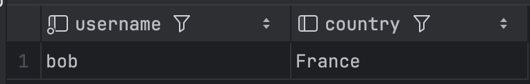
=> Изменения первой транзакции не повлияли на вторую


## Неповторяющееся чтение (Non-Repeatable Read - READ COMMITTED)

Этот сценарий демонстрирует, что с уровнем изоляции `READ COMMITTED`, если вы читаете одни и те же данные дважды в одной и той же транзакции, вы можете получить разные результаты, если другая транзакция изменяет и фиксирует эти данные между вашими чтениями.

**Транзакция 1 (T1):**
```sql
BEGIN;
SET TRANSACTION ISOLATION LEVEL READ COMMITTED;

-- Первое чтение
SELECT username, country FROM "user" WHERE username = 'bob';
-- Germnay
```

**Транзакция 2 (T2):**
```sql
BEGIN;
SET TRANSACTION ISOLATION LEVEL READ COMMITTED;

UPDATE "user"
SET country = 'USA'
WHERE username = 'bob';

COMMIT;
```

**Транзакция 1 (T1) - Продолжение:**
```sql
-- Второе чтение в той же транзакции
SELECT username, country FROM "user" WHERE username = 'bob';
-- Теперь результат покажет 'USA', демонстрируя неповторяющееся чтение.
```
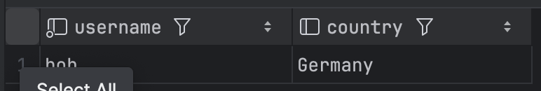
После выполнения второй транзакции:
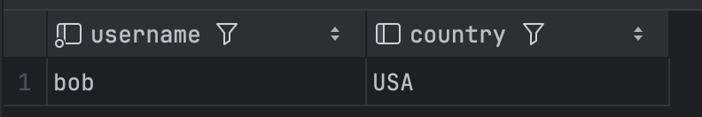


## Повторяемое чтение (Repeatable Read)

Этот уровень гарантирует, что если вы читаете одни и те же данные несколько раз в рамках одной транзакции, вы получите один и тот же результат. Он предотвращает неповторяющиеся чтения.

**Транзакция 1 (T1):**
```sql
BEGIN;
SET TRANSACTION ISOLATION LEVEL REPEATABLE READ;

-- Первое чтение
SELECT username, country FROM "user" WHERE username = 'bob';
-- Результат: 'Germany'

-- Оставляем эту транзакцию открытой и выполняем T2
```

**Транзакция 2 (T2):**
```sql
BEGIN;
SET TRANSACTION ISOLATION LEVEL REPEATABLE READ;

-- Обновляем страну для 'bob' и фиксируем изменения
UPDATE "user"
SET country = 'Canada'
WHERE username = 'bob';

COMMIT;
```

**Транзакция 1 (T1) - Продолжение:**
```sql
-- Второе чтение
SELECT username, country FROM "user" WHERE username = 'bob';
-- Результат по-прежнему 'USA'. T1 не видит зафиксированные изменения из T2.

COMMIT;
```
До и после выполнения второй транзакции результат не меняется
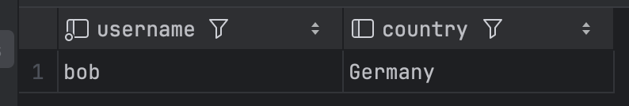


## Фантомное чтение (Phantom Read - REPEATABLE READ)

`REPEATABLE READ` предотвращает фантомное чтение в PostgreSQL. Увидеть его может на уровне Read Commited

**Транзакция 1 (T1):**
```sql
BEGIN;
SET TRANSACTION ISOLATION LEVEL READ COMMITTED;

-- Считаем пользователей из Канады
SELECT COUNT(*) FROM "user" WHERE country = 'Canada';
-- Результат: 3

-- Оставляем эту транзакцию открытой и выполняем T2
```

**Транзакция 2 (T2):**
```sql
BEGIN;
SET TRANSACTION ISOLATION LEVEL READ COMMITTED;

-- Вставляем нового пользователя из Канады
INSERT INTO "user" (email, username, password_hash, country, date_joined, subscription_id)
VALUES ('newuser@mail.com', 'NewUser', 'hash3', 'Canada', '2024-03-20', 1);

COMMIT;
```

**Транзакция 1 (T1) - Продолжение:**
```sql
SELECT COUNT(*) FROM "user" WHERE country = 'Canada';
-- Теперь результат равен 4.

COMMIT;
```
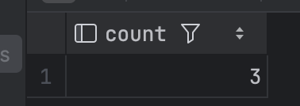
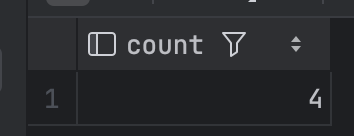

## Serializable

**Пример конфликта сериализации:**
```sql
-- T1
BEGIN;
SET TRANSACTION ISOLATION LEVEL SERIALIZABLE;

-- Пытаемся вставить нового исполнителя
UPDATE artist
SET name='The Void', country='UK', description='Electronic Duo', user_id=1, start_year=2020
WHERE id = 1;
-- T2
BEGIN;
SET TRANSACTION ISOLATION LEVEL SERIALIZABLE;

-- Пытаемся вставить того же исполнителя
UPDATE artist SET name='The Void', country='UK', description='Electronic Duo', user_id=1, start_year=2020 WHERE id = 1;
-- T1
COMMIT;
```
Вызывается ошибка:
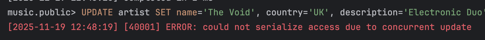

---

# SAVEPOINT

## Одна точка сохранения и откат

```sql
BEGIN;

-- Меняем страну Тимура на Японию
UPDATE "user" SET country = 'Japan' WHERE username = 'Timur';

SAVEPOINT my_savepoint;

-- Меняем страну Амира на Бразилию
UPDATE "user" SET country = 'Brazil' WHERE username = 'Amir';

-- Проверяем текущее состояние
SELECT username, country FROM "user" WHERE username IN ('Timur', 'Amir');
-- Результат: Тимур в Японии, Амир в Бразилии

-- Теперь откатываемся к точке сохранения
ROLLBACK TO SAVEPOINT my_savepoint;

-- Снова проверяем состояние
SELECT username, country FROM "user" WHERE username IN ('Timur', 'Amir');
-- Результат: Тимур в Японии, страна Амира возвращена к предыдущему состоянию.

COMMIT;
-- Изменение страны Тимура будет сохранено.
```
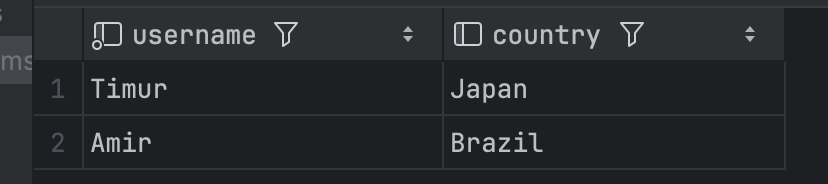
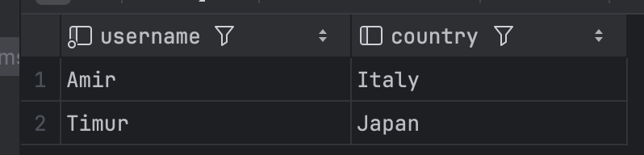


## Несколько точек сохранения


```sql
BEGIN;

-- Первоначальное обновление
UPDATE "user" SET country = 'Australia' WHERE username = 'Timur';
SAVEPOINT sp1;

-- Второе обновление
UPDATE "user" SET country = 'Mexico' WHERE username = 'Amir';
SAVEPOINT sp2;

-- Третье обновление
UPDATE "user" SET subscription_id = 1 WHERE username = 'Timur';

-- Проверяем текущее состояние
SELECT username, country, subscription_id FROM "user" WHERE username IN ('Timur', 'Amir');
-- Результат: Тимур в Австралии с подпиской 1, Амир в Мексике.

-- Откатываемся ко второй точке сохранения
ROLLBACK TO SAVEPOINT sp2;

-- Проверяем состояние после отката к sp2
SELECT username, country, subscription_id FROM "user" WHERE username IN ('Timur', 'Amir');
-- Результат: Изменение подписки Тимура отменено. Он все еще в Австралии. Амир все еще в Мексике.

-- Теперь откатываемся к первой точке сохранения
ROLLBACK TO SAVEPOINT sp1;

-- Проверяем состояние после отката к sp1
SELECT username, country, subscription_id FROM "user" WHERE username IN ('Timur', 'Amir');
-- Результат: Изменение страны Амира отменено. Тимур все еще в Австралии.

COMMIT;
-- Будет сохранено только первое изменение (страна Тимура на Австралию).
```
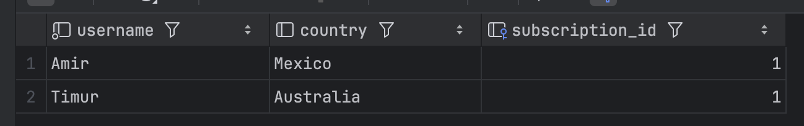
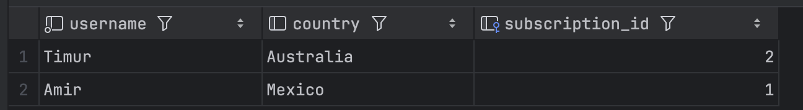


