# Триггеры

## 1. BEFORE INSERT Row-Level триггер - Проверка email при создании пользователя
```sql
CREATE OR REPLACE FUNCTION check_email_before_insert()
RETURNS TRIGGER AS $$
BEGIN
    IF NEW.email NOT LIKE '%@%' THEN
        RAISE EXCEPTION 'Неверный формат email: %', NEW.email;
    END IF;
    RETURN NEW;
END;
$$ LANGUAGE plpgsql;

CREATE TRIGGER trg_check_email_before_insert
BEFORE INSERT ON "user"
FOR EACH ROW
EXECUTE FUNCTION check_email_before_insert();
```

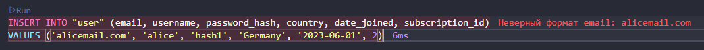

## 2. BEFORE UPDATE Row-Level триггер - Запрет изменения username
```sql
CREATE OR REPLACE FUNCTION prevent_username_change()
RETURNS TRIGGER AS $$
BEGIN
    IF OLD.username IS DISTINCT FROM NEW.username THEN
        RAISE EXCEPTION 'Изменение username запрещено';
    END IF;
    RETURN NEW;
END;
$$ LANGUAGE plpgsql;

CREATE TRIGGER trg_prevent_username_change
BEFORE UPDATE ON "user"
FOR EACH ROW
EXECUTE FUNCTION prevent_username_change();
```

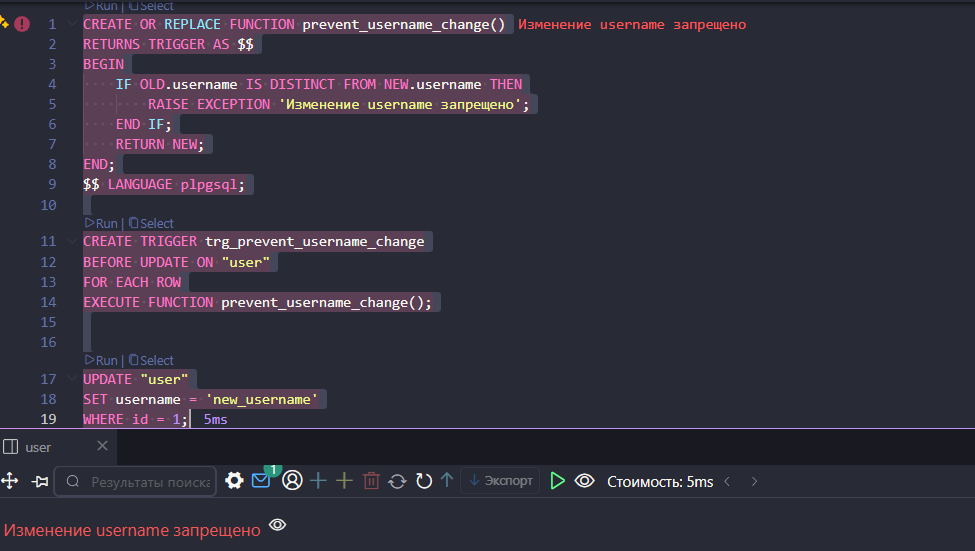

## 3. AFTER INSERT Row-Level триггер - Логирование новых треков
```sql
CREATE TABLE IF NOT EXISTS track_log (
    id SERIAL PRIMARY KEY,
    track_id INTEGER,
    track_title VARCHAR(100),
    created_at TIMESTAMP DEFAULT NOW()
);

CREATE OR REPLACE FUNCTION log_new_track()
RETURNS TRIGGER AS $$
BEGIN
    INSERT INTO track_log (track_id, track_title)
    VALUES (NEW.id, NEW.title);
    RETURN NEW;
END;
$$ LANGUAGE plpgsql;

CREATE TRIGGER trg_log_new_track
AFTER INSERT ON track
FOR EACH ROW
EXECUTE FUNCTION log_new_track();
```

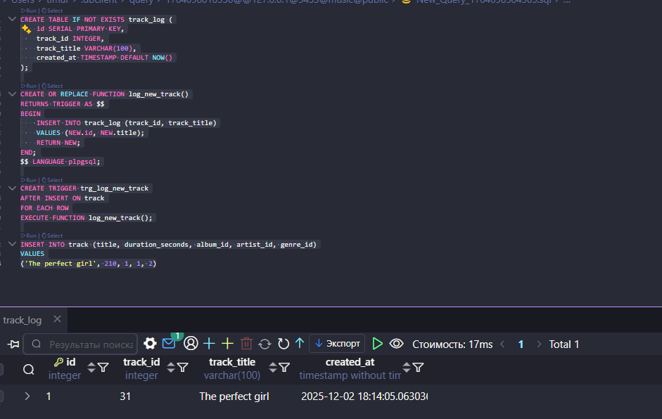

## 4. AFTER UPDATE Row-Level триггер - Логирование изменения цены подписки
```sql
CREATE TABLE IF NOT EXISTS subscription_price_log (
    id SERIAL PRIMARY KEY,
    subscription_id INTEGER,
    old_price DECIMAL(5,2),
    new_price DECIMAL(5,2),
    changed_at TIMESTAMP DEFAULT NOW()
);

CREATE OR REPLACE FUNCTION log_subscription_price_change()
RETURNS TRIGGER AS $$
BEGIN
    IF OLD.price IS DISTINCT FROM NEW.price THEN
        INSERT INTO subscription_price_log (subscription_id, old_price, new_price)
        VALUES (NEW.id, OLD.price, NEW.price);
    END IF;
    RETURN NEW;
END;
$$ LANGUAGE plpgsql;

CREATE TRIGGER trg_log_subscription_price_change
AFTER UPDATE ON subscription
FOR EACH ROW
EXECUTE FUNCTION log_subscription_price_change();
```

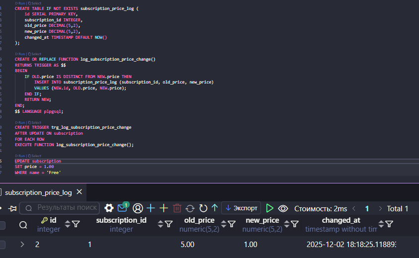

## 5. AFTER DELETE Row-Level триггер - Логирование удаления комментариев
```sql
CREATE TABLE IF NOT EXISTS deleted_comments_log (
    id SERIAL PRIMARY KEY,
    comment_id INTEGER,
    user_id INTEGER,
    track_id INTEGER,
    content TEXT,
    deleted_at TIMESTAMP DEFAULT NOW()
);

CREATE OR REPLACE FUNCTION log_deleted_comment()
RETURNS TRIGGER AS $$
BEGIN
    INSERT INTO deleted_comments_log (comment_id, user_id, track_id, content)
    VALUES (OLD.id, OLD.user_id, OLD.track_id, OLD.content);
    RETURN OLD;
END;
$$ LANGUAGE plpgsql;

CREATE TRIGGER trg_log_deleted_comment
AFTER DELETE ON comment
FOR EACH ROW
EXECUTE FUNCTION log_deleted_comment();
```

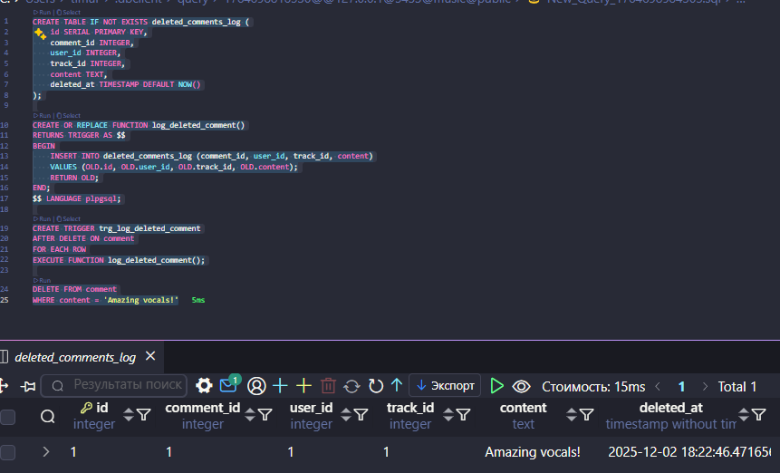

## 6. AFTER INSERT Row-Level триггер с использованием NEW - Автоматический лайк от автора трека
```sql
CREATE OR REPLACE FUNCTION auto_like_from_artist()
RETURNS TRIGGER AS $$
BEGIN
    -- Если у артиста есть связанный user_id, автоматически лайкаем трек
    IF EXISTS (SELECT 1 FROM artist WHERE id = NEW.artist_id AND user_id IS NOT NULL) THEN
        INSERT INTO "like" (user_id, track_id, created_at)
        SELECT user_id, NEW.id, NOW()
        FROM artist
        WHERE id = NEW.artist_id AND user_id IS NOT NULL;
    END IF;
    RETURN NEW;
END;
$$ LANGUAGE plpgsql;

CREATE TRIGGER trg_auto_like_from_artist
AFTER INSERT ON track
FOR EACH ROW
EXECUTE FUNCTION auto_like_from_artist();
```

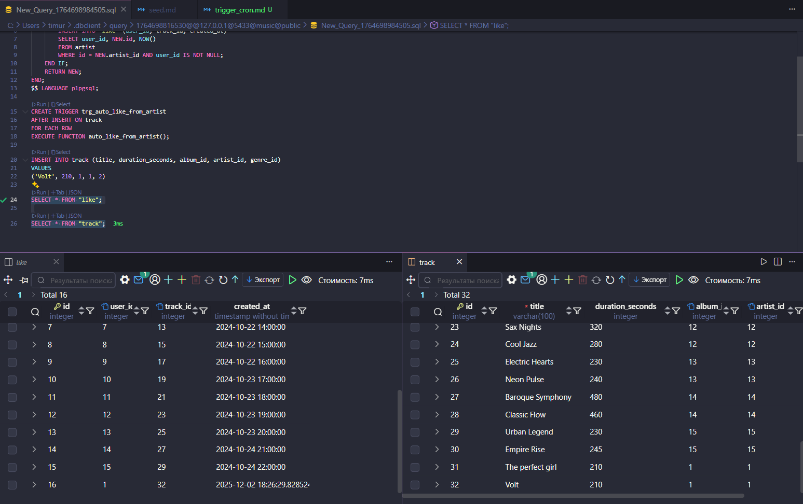

## 7. BEFORE DELETE Row-Level триггер с использованием OLD - Защита от удаления популярных треков
```sql
CREATE OR REPLACE FUNCTION prevent_popular_track_deletion()
RETURNS TRIGGER AS $$
DECLARE
    like_count INTEGER;
BEGIN
    SELECT COUNT(*) INTO like_count
    FROM "like"
    WHERE track_id = OLD.id;
    
    IF like_count > 10 THEN
        RAISE EXCEPTION 'Нельзя удалить трек с более чем 10 лайками (текущее количество: %)', like_count;
    END IF;
    RETURN OLD;
END;
$$ LANGUAGE plpgsql;

CREATE TRIGGER trg_prevent_popular_track_deletion
BEFORE DELETE ON track
FOR EACH ROW
EXECUTE FUNCTION prevent_popular_track_deletion();
```

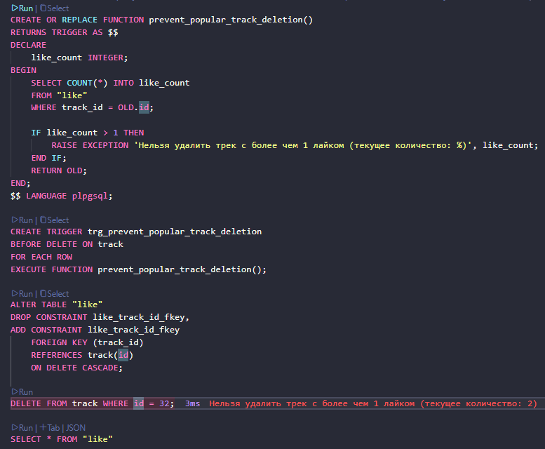

## 8. BEFORE INSERT Statement-Level триггер - Проверка времени добавления треков
```sql
CREATE OR REPLACE FUNCTION check_track_insert_time()
RETURNS TRIGGER AS $$
BEGIN
    IF EXTRACT(HOUR FROM NOW()) < 9 OR EXTRACT(HOUR FROM NOW()) > 17 THEN
        RAISE EXCEPTION 'Добавление треков разрешено только с 9:00 до 17:00';
    END IF;
    RETURN NULL;
END;
$$ LANGUAGE plpgsql;

CREATE TRIGGER trg_check_track_insert_time
BEFORE INSERT ON track
FOR EACH STATEMENT
EXECUTE FUNCTION check_track_insert_time();
```

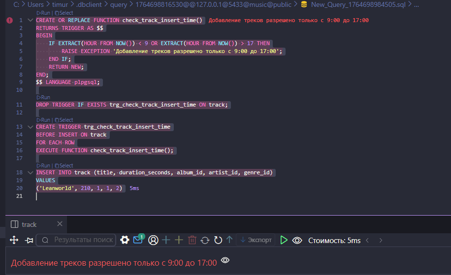

## 9. BEFORE UPDATE Statement-Level триггер - Логирование массового обновления подписок
```sql
CREATE TABLE IF NOT EXISTS subscription_bulk_update_log (
    id SERIAL PRIMARY KEY,
    updated_at TIMESTAMP DEFAULT NOW(),
    description TEXT
);

CREATE OR REPLACE FUNCTION log_subscription_bulk_update()
RETURNS TRIGGER AS $$
BEGIN
    INSERT INTO subscription_bulk_update_log (description)
    VALUES ('Массовое обновление подписок выполнено');
    RETURN NULL;
END;
$$ LANGUAGE plpgsql;

CREATE TRIGGER trg_log_subscription_bulk_update
BEFORE UPDATE ON subscription
FOR EACH STATEMENT
EXECUTE FUNCTION log_subscription_bulk_update();
```

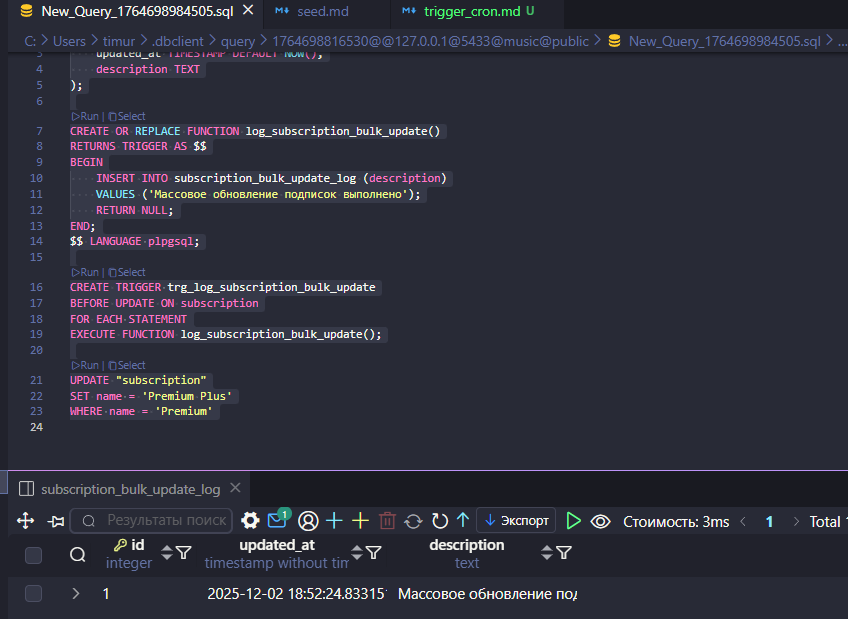

## 10. AFTER INSERT Statement-Level триггер - Уведомление о массовом добавлении пользователей
```sql
CREATE TABLE IF NOT EXISTS user_bulk_insert_log (
    id SERIAL PRIMARY KEY,
    inserted_at TIMESTAMP DEFAULT NOW(),
    message TEXT
);

CREATE OR REPLACE FUNCTION notify_bulk_user_insert()
RETURNS TRIGGER AS $$
BEGIN
    INSERT INTO user_bulk_insert_log (message)
    VALUES ('Выполнено массовое добавление пользователей');
    RETURN NULL;
END;
$$ LANGUAGE plpgsql;

CREATE TRIGGER trg_notify_bulk_user_insert
AFTER INSERT ON "user"
FOR EACH STATEMENT
EXECUTE FUNCTION notify_bulk_user_insert();
```

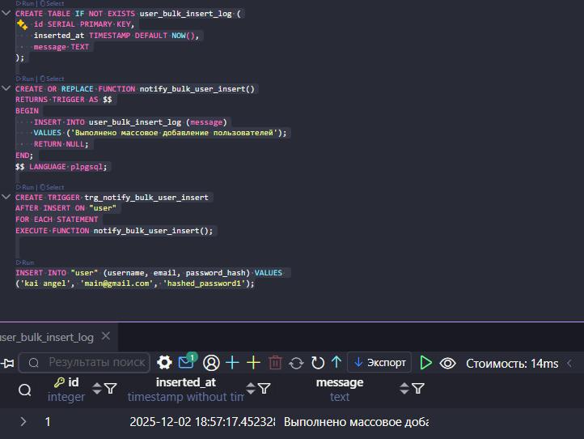

## 11. AFTER UPDATE Statement-Level триггер - Логирование массового обновления альбомов
```sql
CREATE TABLE IF NOT EXISTS album_bulk_update_log (
    id SERIAL PRIMARY KEY,
    updated_at TIMESTAMP DEFAULT NOW(),
    note TEXT
);

CREATE OR REPLACE FUNCTION log_album_bulk_update()
RETURNS TRIGGER AS $$
BEGIN
    INSERT INTO album_bulk_update_log (note)
    VALUES ('Выполнено массовое обновление альбомов');
    RETURN NULL;
END;
$$ LANGUAGE plpgsql;

CREATE TRIGGER trg_log_album_bulk_update
AFTER UPDATE ON album
FOR EACH STATEMENT
EXECUTE FUNCTION log_album_bulk_update();
```

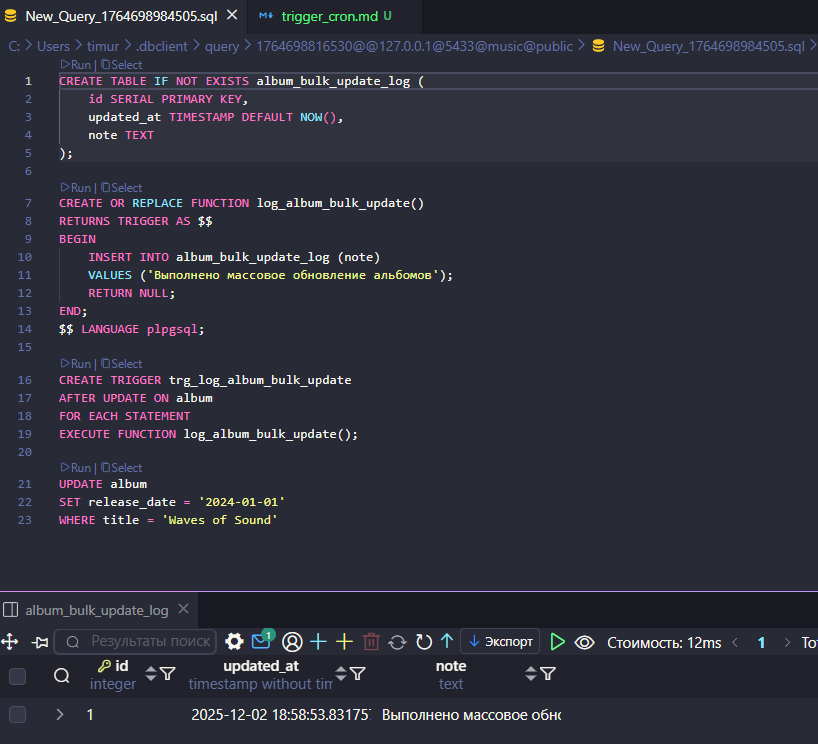

## 12. AFTER DELETE Statement-Level триггер - Уведомление о массовом удалении лайков
```sql
CREATE TABLE IF NOT EXISTS like_bulk_delete_log (
    id SERIAL PRIMARY KEY,
    deleted_at TIMESTAMP DEFAULT NOW(),
    info TEXT
);

CREATE OR REPLACE FUNCTION notify_bulk_like_delete()
RETURNS TRIGGER AS $$
BEGIN    
    IF (SELECT title FROM track WHERE id = OLD.track_id) = 'Volt' THEN
            INSERT INTO like_bulk_delete_log (info)
        VALUES ('Удален Volt(');
    END IF;
    RETURN NULL;
END;
$$ LANGUAGE plpgsql;

CREATE OR REPLACE TRIGGER trg_notify_bulk_like_delete
AFTER DELETE ON "like"
FOR EACH ROW
EXECUTE FUNCTION notify_bulk_like_delete();
```

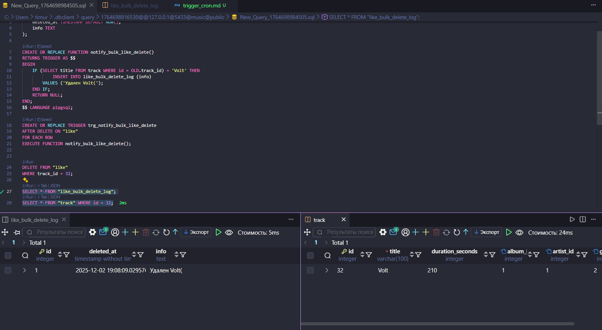

## Отображение списка триггеров
```sql
SELECT 
    trigger_name,
    event_manipulation,
    event_object_table,
    action_timing,
    action_orientation
FROM information_schema.triggers
WHERE trigger_schema = 'public'
ORDER BY event_object_table, trigger_name;
```

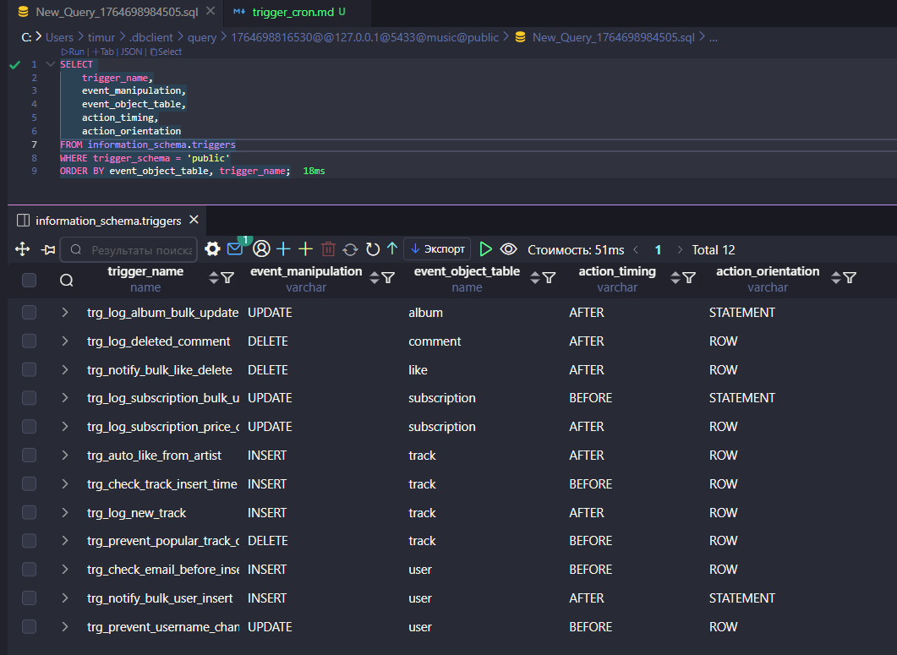

# Кроны (pg_cron) (у меня слетели все таблицы после перезапуска контейнера, дальше на моках)

## Установка расширения pg_cron
```sql
CREATE EXTENSION IF NOT EXISTS pg_cron;
```

## 1. Крон для очистки старых логов треков (каждый день в 19:36)
```sql
INSERT INTO track_log (track_id, track_title, created_at)
VALUES
(1, 'Old Track 1', NOW() - INTERVAL '35 days'),
(2, 'Old Track 2', NOW() - INTERVAL '45 days'),
(3, 'Old Track 3', NOW() - INTERVAL '60 days'),
(4, 'Recent Track 1', NOW() - INTERVAL '5 days'),
(5, 'Recent Track 2', NOW() - INTERVAL '15 days');


SELECT cron.schedule(
    'clean_old_track_logs',
    '36 19 * * *',
    $$DELETE FROM track_log WHERE created_at < NOW() - INTERVAL '30 days'$$
);
```

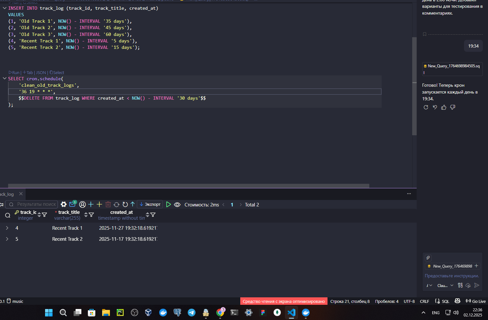

## 2. Крон для обновления статистики прослушиваний (каждый день в 19:46)
```sql
CREATE TABLE IF NOT EXISTS listening_stats (
    id SERIAL PRIMARY KEY,
    total_listens INTEGER,
    updated_at TIMESTAMP DEFAULT NOW()
);

SELECT cron.schedule(
    'update_listening_stats',
    '46 19 * * *',
    $$
    INSERT INTO listening_stats (total_listens) VALUES (floor(random() * 1000)::int)
    $$
);
```

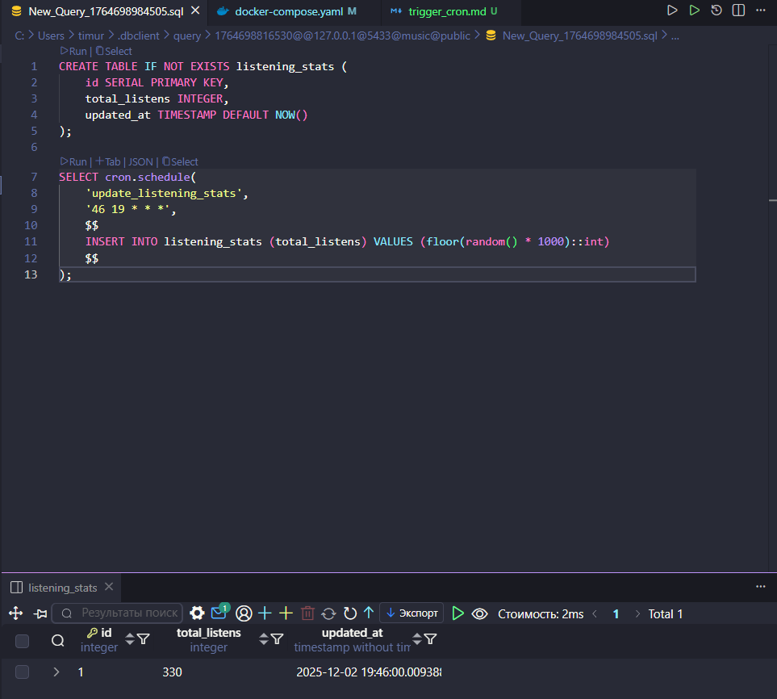

## 3. Крон для еженедельного отчета по новым пользователям (каждый день в 19:59)
```sql
CREATE TABLE IF NOT EXISTS weekly_user_report (
    id SERIAL PRIMARY KEY,
    new_users_count INTEGER,
    report_date DATE DEFAULT CURRENT_DATE
);

SELECT cron.schedule(
    'weekly_new_users_report',
    '59 19 * * *',
    $$
    INSERT INTO weekly_user_report (new_users_count)
    VALUES (228)
    $$
);
```

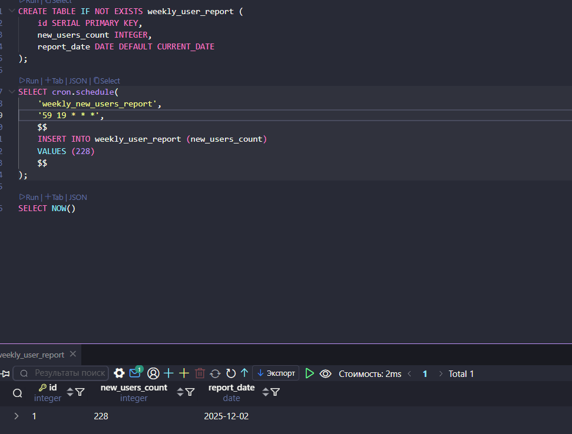

## Запрос на просмотр выполнения кронов
```sql
SELECT 
    jobid,
    jobname,
    schedule,
    command,
    nodename,
    nodeport,
    database,
    username,
    active
FROM cron.job
ORDER BY jobid;
```

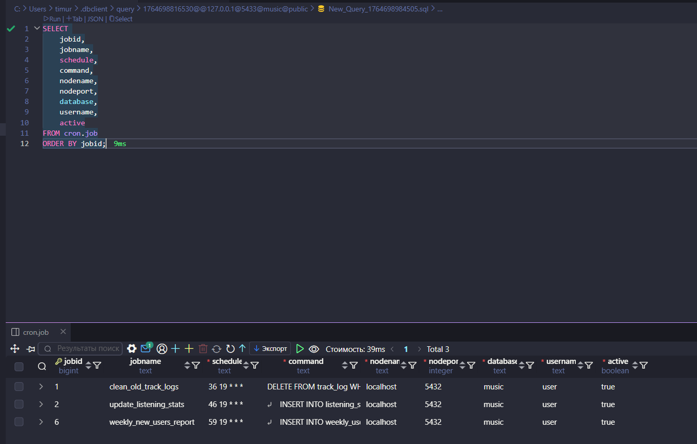

## Запрос на просмотр истории выполнения кронов
```sql
SELECT 
    jobid,
    runid,
    job_pid,
    database,
    username,
    command,
    status,
    return_message,
    start_time,
    end_time
FROM cron.job_run_details
ORDER BY start_time DESC
LIMIT 50;
```

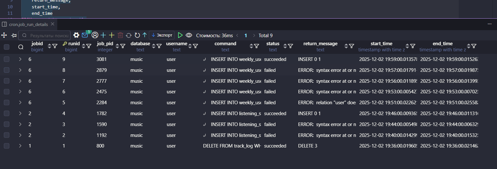

## Запрос на просмотр всех кронов
```sql
SELECT * FROM cron.job;
```

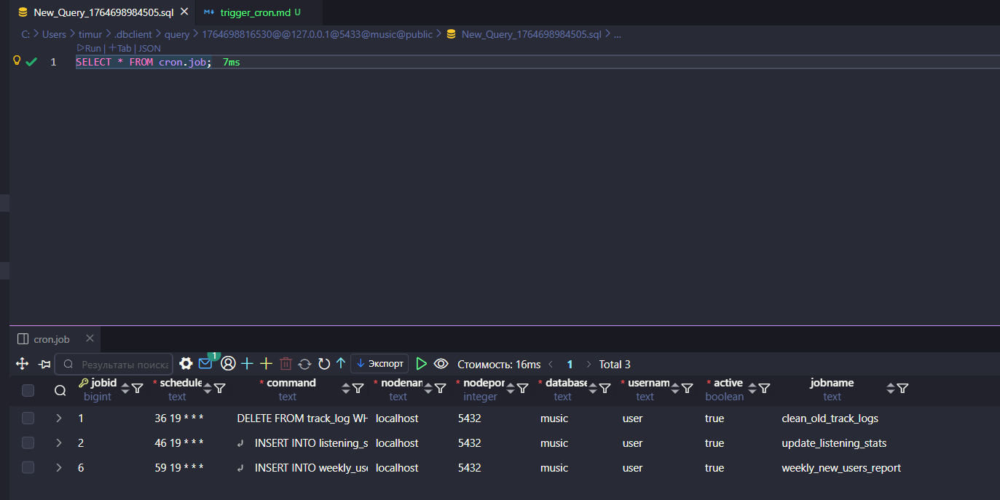